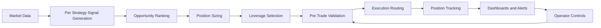

# Automated Trading Platform Showcase

A compact technical snapshot of a live automated financial trading system on Solana. The platform runs multiple quantitative strategies in parallel, generates real-time trade signals, ranks market opportunities, applies layered risk controls, executes trades, and streams operating status to dashboards and alerts.

## What The System Includes

- Multi-strategy signal generation across momentum, breakout, mean-reversion, and event-driven styles
- Opportunity ranking and market selection across multiple assets in the same trading loop
- Strategy-aware risk sizing, stop logic, leverage controls, and portfolio-level exposure checks
- Pre-trade validation for slippage, market impact, funding conditions, and execution-mode gating
- Venue-aware execution routing, trade tracking, live dashboards, alerts, and backtesting workflows

## Quick Snapshot

- Purpose: automate strategy execution, risk management, monitoring, and operational control in one place
- Stack: Node.js backend, Solana-based trading workflows, local data storage, and real-time event streaming
- Operations: web dashboard, terminal dashboard, Telegram-style alerting, and live control actions
- Reliability: 60+ automated tests plus a large set of targeted validation scripts

## High-Level Flow

## Repository Guide

- [diagrams/DIAGRAMS.md](./diagrams/DIAGRAMS.md) renders the core trading, validation, and risk workflows directly on GitHub.
- [diagrams/view-diagrams.html](./diagrams/view-diagrams.html) provides a browser-friendly diagram viewer with the same architecture pack plus execution-routing views.
- [samples/strategy-signal-engine.js](./samples/strategy-signal-engine.js) shows representative multi-factor strategy gating and signal generation logic.
- [samples/strategy-aware-risk.js](./samples/strategy-aware-risk.js) shows strategy-specific risk configuration and equal-risk position sizing.
- [samples/venue-aware-execution.js](./samples/venue-aware-execution.js) shows execution routing, retries, and venue-specific gating.

## Implementation Themes

- Signal generation is multi-factor and position-aware rather than trigger-only. Entry logic combines trend, momentum, volatility, volume, cooldown, and higher-timeframe context.
- Risk management is strategy-aware. Different strategies carry different stop, take-profit, holding-period, and sizing rules.
- Execution is not a single client call. The platform routes by market and venue state, applies retries, and blocks trades when validation or collateral conditions fail.
- Operations are first-class. The trading engine exposes live monitoring, manual control actions, and backtesting tools alongside production logic.
