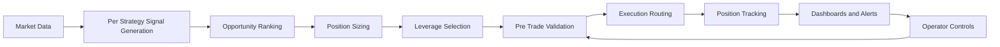
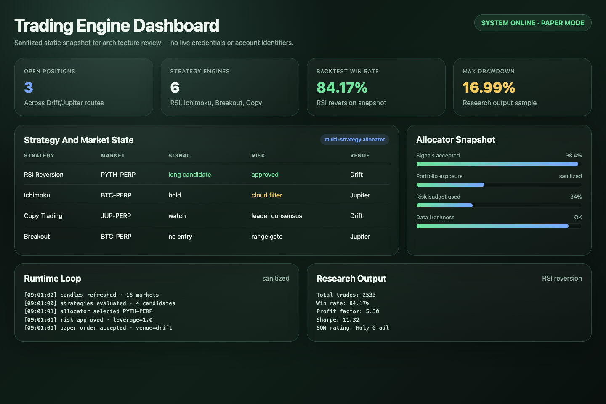
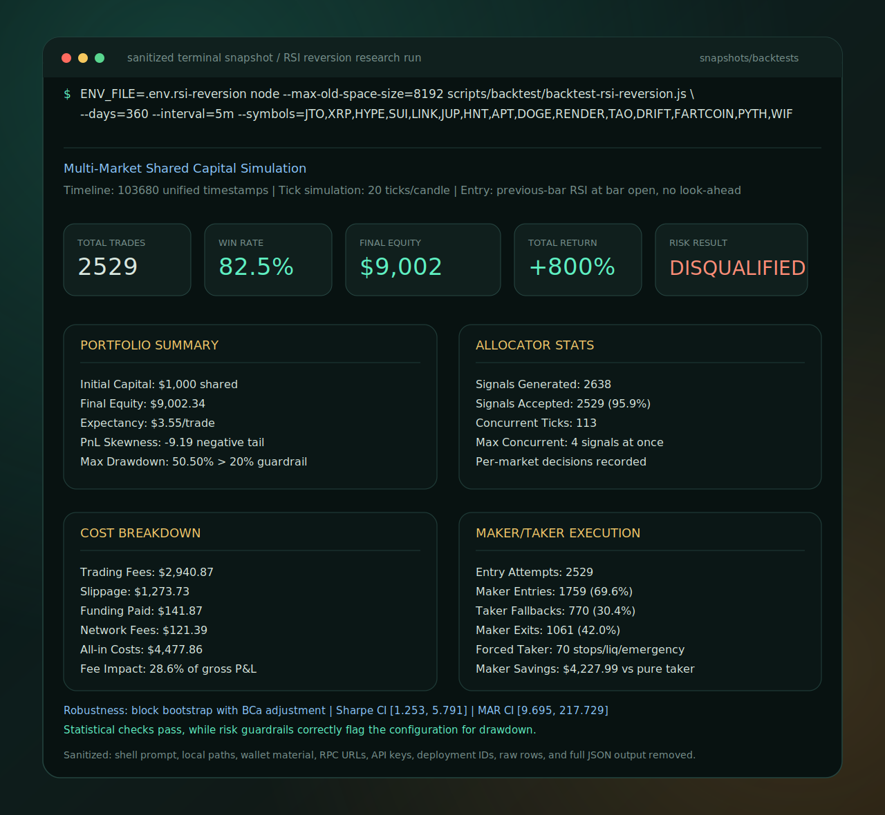

# Solana Network Trading Engine Showcase

This repository contains a sanitized production-source subset of a live Solana-based DeFi network application for automated financial trading. The trading engine runs multiple quantitative strategies in parallel, evaluates opportunities across markets, normalizes network and venue state, applies layered risk controls, routes execution through venue-specific clients, and streams operating status to dashboards and alerts.

The engine uses a DeFi-native execution model: trades are routed through Solana-based venues from a wallet-controlled setup, so operation does not require a centralized exchange account or exchange custody. This keeps access permissionless, supports multiple venues from one runtime, and makes wallet, RPC, venue, and risk configuration the primary deployment inputs. Current showcase paths include Solana DeFi venues such as Drift and Jupiter, with an adapter-based structure that can extend to additional DeFi AMM-style venues such as PancakeSwap where compatible adapters are added.

## Reviewer Context

- **Business signal:** Turns wallet-based DeFi market access into an operated trading workflow with controls, dashboards, alerts, and repeatable research outputs.
- **Technical signal:** Includes real production modules for allocation, risk, venue routing, low-level Solana execution, encrypted secrets, tests, and backtests rather than a toy demo.
- **Product signal:** Treats trading as an operational system with user controls, auditability, staged rollout modes, and failure handling.
- **Risk signal:** Backtest snapshots include drawdown, fees, slippage, maker/taker mix, robustness checks, and disqualification logic; they are validation artifacts, not performance marketing.

## Review First

- **5-minute scan:** read this README, view the dashboard snapshot, and skim the backtest visual.
- **15-minute review:** open the PRD, ERD, and diagrams to understand product scope and architecture.
- **Technical review:** inspect [utils/market-allocator.js](./utils/market-allocator.js), [risk-manager.js](./risk-manager.js), [src/execution/venue-aware-trade-executor.js](./src/execution/venue-aware-trade-executor.js), [src/execution/perps-raw-client.js](./src/execution/perps-raw-client.js), [tools/secrets-manager.js](./tools/secrets-manager.js), and [tests/](./tests).

- [docs/PRD.md](./docs/PRD.md): product requirements, capabilities, user flows, risk controls, and success metrics.
- [docs/ERD.md](./docs/ERD.md): engineering requirements, network/application boundaries, module responsibilities, and acceptance criteria.
- [diagrams/DIAGRAMS.md](./diagrams/DIAGRAMS.md): GitHub-rendered diagram hub and single source of truth — system context, architecture, orchestration, allocation, risk, validation, venue-aware execution, execution modes, copy-trading, data model, security, operator controls, and the Telegram control tree.
- [snapshots/dashboard/trading-engine-dashboard-snapshot.png](./snapshots/dashboard/trading-engine-dashboard-snapshot.png): sanitized static dashboard screenshot for a quick visual review.
- [snapshots/backtests/rsi-reversion-backtest-terminal-snapshot.svg](./snapshots/backtests/rsi-reversion-backtest-terminal-snapshot.svg): visual terminal-style snapshot of a multi-market RSI reversion backtest.
- [snapshots/backtests/rsi-reversion-terminal-output.txt](./snapshots/backtests/rsi-reversion-terminal-output.txt): sanitized terminal output excerpt from a multi-market RSI reversion backtest.
- [snapshots/logs/](./snapshots/logs): sanitized startup and runtime-loop log excerpts.
- [docs/SANITIZATION.md](./docs/SANITIZATION.md): what was intentionally excluded from this public showcase.

## System Capabilities

- DeFi-native, wallet-based execution without centralized exchange account requirements
- Multi-venue access through Solana-based perpetuals infrastructure and venue-aware routing, with an adapter pattern for broader DeFi venue expansion
- Multi-strategy signal generation across momentum, breakout, mean-reversion, and event-driven styles
- Dynamic market allocator that is both strategy-aware and market-aware, with correlation, venue, historical performance, exposure, cooldown, and risk-adjusted scoring inputs
- Strategy-aware risk sizing, stop logic, leverage controls, and portfolio-level exposure checks
- Pre-trade validation for slippage, market impact, funding conditions, and execution-mode gating
- Venue-aware execution routing, trade tracking, live dashboards, alerts, and backtesting workflows

## Technical Snapshot

- Runtime: Node.js trading loop with strategy loading, market updates, allocation, risk checks, execution, and telemetry
- Data: SQLite operational store for trades, order guards, diagnostics, market data, instance locks, and copy-trading snapshots
- Execution: non-custodial Solana/DeFi execution clients with venue-aware routing, guarded execution, shadow mode, and limited-live controls
- Operations: API/WebSocket server, terminal dashboard, Telegram-style controls, structured logs, and trade journaling
- Research: strategy-specific backtest runners, allocator diagnostics, and targeted tests
- Security: encrypted secrets and wallet tooling using authenticated encryption, key derivation, file-permission checks, masked displays, and no secret-byte logging
- Reliability: 60+ automated tests plus a large set of targeted validation scripts
- Scope: source-code showcase only; private environment files, wallets, logs, databases, and result dumps are intentionally excluded

## High-Level Flow



## Dashboard Snapshot



## Backtest Output Snapshot



The `snapshots/` folder includes static review artifacts: a dashboard screenshot, the HTML used to render it, a visual terminal-style backtest snapshot, the full sanitized terminal backtest excerpt, and sanitized startup/runtime logs. These are safe public examples with wallet material, RPC URLs, API keys, deployment IDs, raw databases, raw trade rows, and full generated outputs removed.

The backtest output is included to show the research workflow and risk-review depth: no-lookahead timing notes, shared-capital simulation, allocator diagnostics, cost model, maker/taker analysis, drawdown limits, worst/best trade inspection, duration distribution, and robustness checks.

## Telegram Controls

The Telegram surface lets the operator review status, follow leader wallets, pause/resume the engine, review and route manual positions, and approve guarded trades — all behind a shared auth, rate-limit, and callback-sanitization layer. The full command tree is in the diagram hub: [Telegram Control Tree](./diagrams/DIAGRAMS.md#17-telegram-control-tree).

## Repository Guide

| Area                    | Files                                                                                                                                                                                                                                                                                                            |
| ----------------------- | ---------------------------------------------------------------------------------------------------------------------------------------------------------------------------------------------------------------------------------------------------------------------------------------------------------------- |
| Runtime orchestration   | [bot.js](./bot.js), [config.js](./config.js), [src/core/validate-config.js](./src/core/validate-config.js)                                                                                                                                                                                                       |
| Risk and allocation     | [risk-manager.js](./risk-manager.js), [utils/market-allocator.js](./utils/market-allocator.js), [utils/portfolio-risk.js](./utils/portfolio-risk.js), [utils/dynamic-leverage.js](./utils/dynamic-leverage.js)                                                                                                   |
| Strategy loading        | [utils/strategy-factory.js](./utils/strategy-factory.js), [utils/strategy-env-manager.js](./utils/strategy-env-manager.js)                                                                                                                                                                                       |
| Execution               | [src/execution/venue-aware-trade-executor.js](./src/execution/venue-aware-trade-executor.js), [src/execution/perps-live-client.js](./src/execution/perps-live-client.js), [src/execution/perps-drift-client.js](./src/execution/perps-drift-client.js), [drift-subprocess/index.js](./drift-subprocess/index.js) |
| Data and telemetry      | [db.js](./db.js), [src/core/journal.js](./src/core/journal.js), [src/core/logger.js](./src/core/logger.js), [utils/gate-analytics.js](./utils/gate-analytics.js)                                                                                                                                                 |
| Operations              | [src/operations/ui-server.js](./src/operations/ui-server.js), [src/operations/dashboard.js](./src/operations/dashboard.js), [src/operations/telegram-control.js](./src/operations/telegram-control.js), [src/operations/control-panel.js](./src/operations/control-panel.js)                                     |
| Research and validation | [scripts/backtest/](./scripts/backtest), [tests/](./tests)                                                                                                                                                                                                                                                       |

## File Tree

```text
.
├── bot.js                    # runtime entry point
├── config.js                 # environment-backed configuration
├── risk-manager.js           # strategy-aware risk rules
├── db.js                     # SQLite operational schema and query helpers
├── LICENSE                   # ISC license matching the production repo
├── src/
│   ├── core/                 # logging, journaling, validation helpers
│   ├── execution/            # venue clients and execution routing
│   ├── operations/           # API server, dashboards, control surfaces
│   └── strategies/           # production strategy implementations
├── config/                   # public/static market metadata and env templates
│   └── env-templates/        # shared env template and strategy env templates
│       └── strategy-env/     # strategy-specific env templates
├── utils/                    # allocator, feeds, risk helpers, copy-trading models
├── scripts/backtest/         # runnable backtests plus shared helper library
│   └── lib/                  # reusable backtest engine utilities
├── scripts/test/             # targeted strategy smoke tests
├── tests/                    # representative unit and integration tests
├── snapshots/                # sanitized dashboard, log, and terminal backtest outputs
│   ├── dashboard/            # static dashboard screenshot and render HTML
│   ├── logs/                 # startup and runtime-loop log excerpts
│   └── backtests/            # terminal output excerpts from backtest runs
├── tools/                    # operational helper source, with no secret values
├── docs/                     # PRD, ERD, sanitization notes
└── diagrams/                 # Mermaid architecture diagrams
```

## Strategy Files

- [src/strategies/enhanced-momentum-strategy.js](./src/strategies/enhanced-momentum-strategy.js)
- [src/strategies/enhanced-momentum-rsi-strategy.js](./src/strategies/enhanced-momentum-rsi-strategy.js)
- [src/strategies/btc-breakout-strategy.js](./src/strategies/btc-breakout-strategy.js)
- [src/strategies/scalping-strategy.js](./src/strategies/scalping-strategy.js)
- [src/strategies/predicta-strategy.js](./src/strategies/predicta-strategy.js)
- [src/strategies/ichimoku-cloud-breakout-strategy.js](./src/strategies/ichimoku-cloud-breakout-strategy.js)
- [src/strategies/copy-trading-strategy.js](./src/strategies/copy-trading-strategy.js)
- [src/strategies/copy-trading-event-strategy.js](./src/strategies/copy-trading-event-strategy.js)
- [src/strategies/copy-trading-meta-strategy.js](./src/strategies/copy-trading-meta-strategy.js)

## Implementation Themes

- Signal generation is multi-factor and position-aware rather than trigger-only. Entry logic combines trend, momentum, volatility, volume, cooldown, and higher-timeframe context.
- Allocation is dynamic, not round-robin. The allocator scores opportunities by strategy type, market tier, recent performance, expected return, volatility, correlation exposure, venue capital pool, and cooldown state before selecting trades.
- Risk management is strategy-aware. Different strategies carry different stop, take-profit, holding-period, sizing, leverage, and allocator-driven risk recommendation rules.
- Execution is not a single client call. The platform routes by market and venue state, applies retries, and blocks trades when validation or collateral conditions fail.
- Protocol integration includes low-level Solana work, including PDA derivation, idempotent associated-token-account setup, account ownership auditing, transaction construction, and fallbacks for incomplete or evolving venue API surfaces.
- Runtime resilience patterns include lazy-loaded dependencies, optional client initialization, retry/error classification, idempotent order guards, RPC failover, stale-price handling, shadow mode, and limited-live rollout gates.
- Secrets are treated as first-class operational infrastructure. The showcase includes encrypted wallet/secrets tooling and secure wallet loading patterns while excluding actual private values.
- Operations are first-class. The trading engine exposes live monitoring, manual control actions, and backtesting tools alongside production logic.

## Public Showcase Scope

This is a code-reviewable snapshot, not a turnkey deployment or an investment-performance claim. Live operation is wallet-based and does not require a centralized exchange account, but it still requires private environment configuration, RPC endpoints, funded wallet material, and operational secrets that are deliberately not included.

## License

ISC License. See [LICENSE](./LICENSE).
