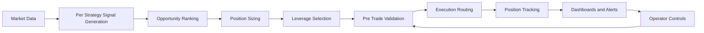

# Solana Automated Trading System Showcase

This repository contains a sanitized production-source subset of a live automated financial trading system on Solana. The platform runs multiple quantitative strategies in parallel, generates real-time trade signals, ranks market opportunities, applies layered risk controls, executes trades, and streams operating status to dashboards and alerts.

## Review First

- [docs/PRD.md](./docs/PRD.md): product requirements, capabilities, user flows, risk controls, and success metrics.
- [docs/ERD.md](./docs/ERD.md): full operational data model with Mermaid ERD, table catalog, indexes, and logical relationships.
- [diagrams/DIAGRAMS.md](./diagrams/DIAGRAMS.md): GitHub-rendered system flow diagrams for trading, validation, risk, routing, and multi-market execution.
- [docs/SANITIZATION.md](./docs/SANITIZATION.md): what was intentionally excluded from this public showcase.

## System Capabilities

- Multi-strategy signal generation across momentum, breakout, mean-reversion, and event-driven styles
- Opportunity ranking and market selection across multiple assets in the same trading loop
- Strategy-aware risk sizing, stop logic, leverage controls, and portfolio-level exposure checks
- Pre-trade validation for slippage, market impact, funding conditions, and execution-mode gating
- Venue-aware execution routing, trade tracking, live dashboards, alerts, and backtesting workflows

## Technical Snapshot

- Runtime: Node.js trading loop with strategy loading, market updates, allocation, risk checks, execution, and telemetry
- Data: SQLite operational store for trades, order guards, diagnostics, market data, instance locks, and copy-trading snapshots
- Execution: Solana execution clients with venue-aware routing, guarded execution, shadow mode, and limited-live controls
- Operations: API/WebSocket server, terminal dashboard, Telegram-style controls, structured logs, and trade journaling
- Research: strategy-specific backtest runners, allocator diagnostics, and targeted tests
- Reliability: 60+ automated tests plus a large set of targeted validation scripts
- Scope: source-code showcase only; private environment files, wallets, logs, databases, and result dumps are intentionally excluded

## High-Level Flow



## Repository Guide

| Area | Files |
| --- | --- |
| Runtime orchestration | [bot.js](./bot.js), [config.js](./config.js), [src/core/validate-config.js](./src/core/validate-config.js) |
| Risk and allocation | [risk-manager.js](./risk-manager.js), [utils/market-allocator.js](./utils/market-allocator.js), [utils/portfolio-risk.js](./utils/portfolio-risk.js), [utils/dynamic-leverage.js](./utils/dynamic-leverage.js) |
| Strategy loading | [utils/strategy-factory.js](./utils/strategy-factory.js), [utils/strategy-env-manager.js](./utils/strategy-env-manager.js) |
| Execution | [src/execution/venue-aware-trade-executor.js](./src/execution/venue-aware-trade-executor.js), [src/execution/perps-live-client.js](./src/execution/perps-live-client.js), [src/execution/perps-drift-client.js](./src/execution/perps-drift-client.js), [drift-subprocess/index.js](./drift-subprocess/index.js) |
| Data and telemetry | [db.js](./db.js), [src/core/journal.js](./src/core/journal.js), [src/core/logger.js](./src/core/logger.js), [utils/gate-analytics.js](./utils/gate-analytics.js) |
| Operations | [src/operations/ui-server.js](./src/operations/ui-server.js), [src/operations/dashboard.js](./src/operations/dashboard.js), [src/operations/telegram-control.js](./src/operations/telegram-control.js), [src/operations/control-panel.js](./src/operations/control-panel.js) |
| Research and validation | [scripts/backtest/](./scripts/backtest), [backtest/](./backtest), [tests/](./tests) |

## File Tree

```text
.
├── bot.js                    # runtime entry point
├── config.js                 # environment-backed configuration
├── risk-manager.js           # strategy-aware risk rules
├── db.js                     # SQLite operational schema and query helpers
├── src/
│   ├── core/                 # logging, journaling, validation helpers
│   ├── execution/            # venue clients and execution routing
│   ├── operations/           # API server, dashboards, control surfaces
│   └── strategies/           # production strategy implementations
├── config/                   # public/static market metadata used by included modules
├── utils/                    # allocator, feeds, risk helpers, copy-trading models
├── backtest/                 # shared backtest engine utilities
├── scripts/backtest/         # strategy-specific backtest runners
├── scripts/test/             # targeted strategy smoke tests
├── tests/                    # representative unit and integration tests
├── tools/                    # operational helper source, with no secret values
├── docs/                     # PRD, ERD, sanitization notes
└── diagrams/                 # Mermaid architecture diagrams
```

## Strategy Files

- [src/strategies/enhanced-momentum-strategy.js](./src/strategies/enhanced-momentum-strategy.js)
- [src/strategies/enhanced-momentum-rsi-strategy.js](./src/strategies/enhanced-momentum-rsi-strategy.js)
- [src/strategies/btc-breakout-strategy.js](./src/strategies/btc-breakout-strategy.js)
- [src/strategies/scalping-strategy.js](./src/strategies/scalping-strategy.js)
- [src/strategies/predicta-strategy.js](./src/strategies/predicta-strategy.js)
- [src/strategies/ichimoku-cloud-breakout-strategy.js](./src/strategies/ichimoku-cloud-breakout-strategy.js)
- [src/strategies/copy-trading-strategy.js](./src/strategies/copy-trading-strategy.js)
- [src/strategies/copy-trading-event-strategy.js](./src/strategies/copy-trading-event-strategy.js)
- [src/strategies/copy-trading-meta-strategy.js](./src/strategies/copy-trading-meta-strategy.js)

## Implementation Themes

- Signal generation is multi-factor and position-aware rather than trigger-only. Entry logic combines trend, momentum, volatility, volume, cooldown, and higher-timeframe context.
- Risk management is strategy-aware. Different strategies carry different stop, take-profit, holding-period, and sizing rules.
- Execution is not a single client call. The platform routes by market and venue state, applies retries, and blocks trades when validation or collateral conditions fail.
- Operations are first-class. The trading engine exposes live monitoring, manual control actions, and backtesting tools alongside production logic.

## Public Showcase Scope

This is a code-reviewable snapshot, not a turnkey deployment. Live trading requires private environment configuration, RPC endpoints, wallet material, and operational secrets that are deliberately not included.
