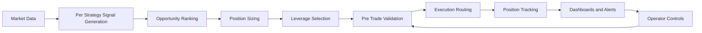

# Solana Automated Trading System Showcase

This repository contains a sanitized production-source subset of a live automated financial trading system on Solana. The platform runs multiple quantitative strategies in parallel, generates real-time trade signals, ranks market opportunities, applies layered risk controls, executes trades, and streams operating status to dashboards and alerts.

## What The System Includes

- Multi-strategy signal generation across momentum, breakout, mean-reversion, and event-driven styles
- Opportunity ranking and market selection across multiple assets in the same trading loop
- Strategy-aware risk sizing, stop logic, leverage controls, and portfolio-level exposure checks
- Pre-trade validation for slippage, market impact, funding conditions, and execution-mode gating
- Venue-aware execution routing, trade tracking, live dashboards, alerts, and backtesting workflows

## Quick Snapshot

- Purpose: automate strategy execution, risk management, monitoring, and operational control in one place
- Stack: Node.js backend, Solana-based trading workflows, local data storage, and real-time event streaming
- Operations: web dashboard, terminal dashboard, Telegram-style alerting, and live control actions
- Reliability: 60+ automated tests plus a large set of targeted validation scripts
- Scope: source-code showcase only; private environment files, wallets, logs, databases, and result dumps are intentionally excluded

## High-Level Flow

## Repository Guide

- [bot.js](./bot.js) is the production runtime loop that coordinates strategy loading, market updates, risk checks, execution, telemetry, and operator controls.
- [risk-manager.js](./risk-manager.js) contains strategy-aware risk profiles, position sizing, stops, take-profit handling, and portfolio constraints.
- [utils/strategy-factory.js](./utils/strategy-factory.js) wires markets to strategy implementations and isolates per-strategy configuration.
- [utils/market-allocator.js](./utils/market-allocator.js) ranks candidate trades across markets and applies portfolio/per-market selection rules.
- [services/venue-aware-trade-executor.js](./services/venue-aware-trade-executor.js) routes live orders by market and venue state, including guarded and shadow modes.
- [perps-live-client.js](./perps-live-client.js) and [perps-drift-client.js](./perps-drift-client.js) show the execution client layers used by the runtime.
- [drift-subprocess/index.js](./drift-subprocess/index.js) shows the isolated subprocess bridge used for venue-specific execution paths.
- [tests/](./tests) includes selected risk, strategy, venue-routing, copy-trading, and allocator tests.
- [scripts/backtest/](./scripts/backtest) includes selected production backtest runners and shared backtest utilities.
- [diagrams/DIAGRAMS.md](./diagrams/DIAGRAMS.md) renders the core trading, validation, and risk workflows directly on GitHub.
- [diagrams/view-diagrams.html](./diagrams/view-diagrams.html) provides a browser-friendly diagram viewer with the same architecture pack.

## Strategy Files

- [enhanced-momentum-strategy.js](./enhanced-momentum-strategy.js)
- [enhanced-momentum-rsi-strategy.js](./enhanced-momentum-rsi-strategy.js)
- [btc-breakout-strategy.js](./btc-breakout-strategy.js)
- [scalping-strategy.js](./scalping-strategy.js)
- [predicta-strategy.js](./predicta-strategy.js)
- [ichimoku-cloud-breakout-strategy.js](./ichimoku-cloud-breakout-strategy.js)
- [copy-trading-strategy.js](./copy-trading-strategy.js)
- [copy-trading-event-strategy.js](./copy-trading-event-strategy.js)
- [copy-trading-meta-strategy.js](./copy-trading-meta-strategy.js)

## Implementation Themes

- Signal generation is multi-factor and position-aware rather than trigger-only. Entry logic combines trend, momentum, volatility, volume, cooldown, and higher-timeframe context.
- Risk management is strategy-aware. Different strategies carry different stop, take-profit, holding-period, and sizing rules.
- Execution is not a single client call. The platform routes by market and venue state, applies retries, and blocks trades when validation or collateral conditions fail.
- Operations are first-class. The trading engine exposes live monitoring, manual control actions, and backtesting tools alongside production logic.
