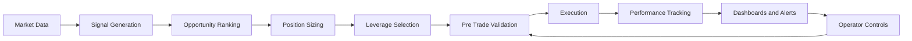

# Automated Trading Platform Showcase

This is a small, hiring-friendly snapshot of a larger personal project: an automated trading and monitoring platform built to test ideas, manage risk, and monitor live activity in real time.

## Resume Bullets

- Built an automated trading platform that combined strategy execution, live monitoring, performance tracking, and operational controls in one system.
- Added risk controls including capital sizing, stop-loss rules, position limits, and pause/close safeguards.
- Created web, terminal, and mobile-friendly monitoring tools with real-time updates, alerts, and control actions.
- Developed a testing and backtesting workflow to compare ideas, validate changes, and improve reliability before live use.

## What The System Included

- Multiple trading strategies and configurable execution logic
- Risk management rules for sizing, exits, and exposure control
- Real-time dashboards, alerts, and operator controls
- Trade journaling, performance tracking, and status reporting
- Backtesting, diagnostics, and validation tooling

## Quick Snapshot

- Purpose: automate research, execution, monitoring, and control in one place
- Build: Node.js backend, live dashboards, local data storage, real-time event streaming
- Operations: web dashboard, terminal dashboard, and alert-based monitoring
- Reliability: 60+ automated tests plus a large set of targeted validation scripts

## Visual Summary From The Original Project Diagrams

The original project included a diagram pack that mapped the system end to end. In simple terms, the visuals showed four main ideas:

- The platform followed a full decision chain from market data to signal generation, opportunity ranking, position sizing, leverage selection, trade validation, execution, and performance tracking.
- Entry decisions were not one-step triggers. They were gated through warm-up checks, trend and momentum filters, breakout confirmation, volume checks, cooldowns, and position-aware logic.
- Risk management was layered. The system checked portfolio limits, individual position limits, slippage, market impact, funding conditions, and approval rules before allowing execution.
- The platform was built to run across multiple markets in parallel while ranking the best opportunities, applying exit priorities, and supporting both fixed-capital and compounding capital modes.

## System Map

## How To Review This Project

If you are scanning quickly, the main takeaway is that this project was not just a trading script. It was a full operating system around automated decision-making: strategy logic, ranked selection, layered risk controls, execution checks, monitoring, reporting, and operational safety tools.
