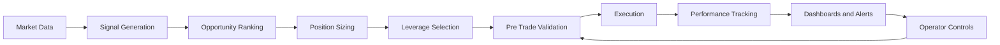

# Automated Trading Platform Showcase

This repository is a summarized showcase of a live automated financial trading platform on Solana. The system runs multiple quantitative strategies in parallel, generates trade signals in real time, applies layered risk controls, executes trades, and provides dashboards and alerts for monitoring and control.

## What The System Includes

- Multiple trading strategies and configurable execution logic
- Risk management rules for sizing, exits, and exposure control
- Real-time dashboards, alerts, and operator controls
- Trade journaling, performance tracking, and status reporting
- Backtesting, diagnostics, and validation tooling

## Quick Snapshot

- Purpose: automate strategy execution, risk management, monitoring, and operational control in one place
- Stack: Node.js backend, Solana-based trading workflows, local data storage, and real-time event streaming
- Operations: web dashboard, terminal dashboard, Telegram-style alerting, and live control actions
- Reliability: 60+ automated tests plus a large set of targeted validation scripts

## Architecture Summary

The original project includes a diagram pack that maps the trading workflow end to end. In simple terms, the visuals show four main ideas:

- The platform follows a full decision chain from market data to signal generation, opportunity ranking, position sizing, leverage selection, trade validation, execution, and performance tracking.
- Entry decisions were not one-step triggers. They were gated through warm-up checks, trend and momentum filters, breakout confirmation, volume checks, cooldowns, and position-aware logic.
- Risk management is layered. The system checks portfolio limits, individual position limits, slippage, market impact, funding conditions, and approval rules before allowing execution.
- The platform runs across multiple markets in parallel while ranking the best opportunities, applying exit priorities, and supporting both fixed-capital and compounding capital modes.

## System Map

## How To Review This Project

If you are scanning quickly, the main takeaway is that this is not just a trading script. It is a full operating system around automated financial decision-making: strategy logic, ranked selection, layered risk controls, execution checks, monitoring, reporting, and operational safety tools.
