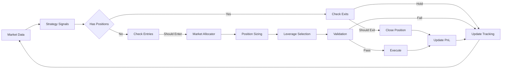
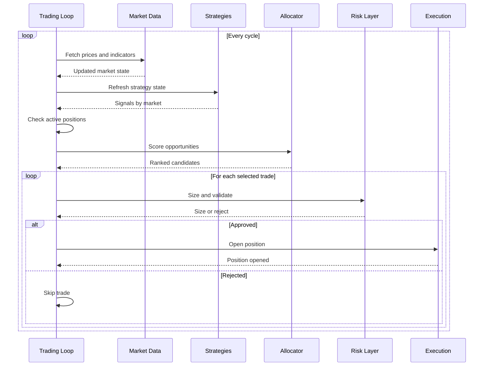
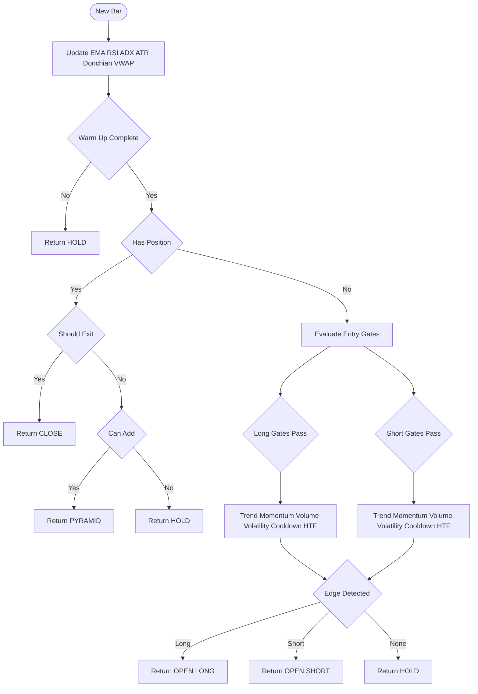
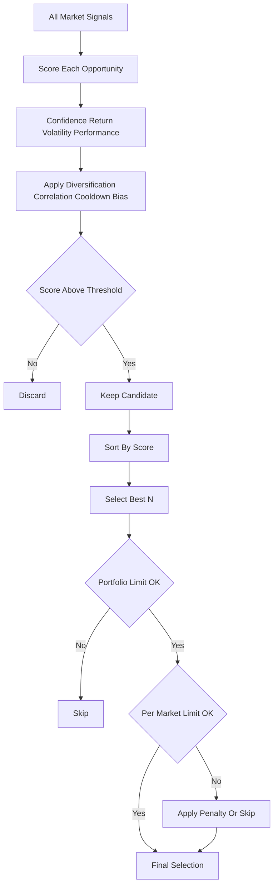
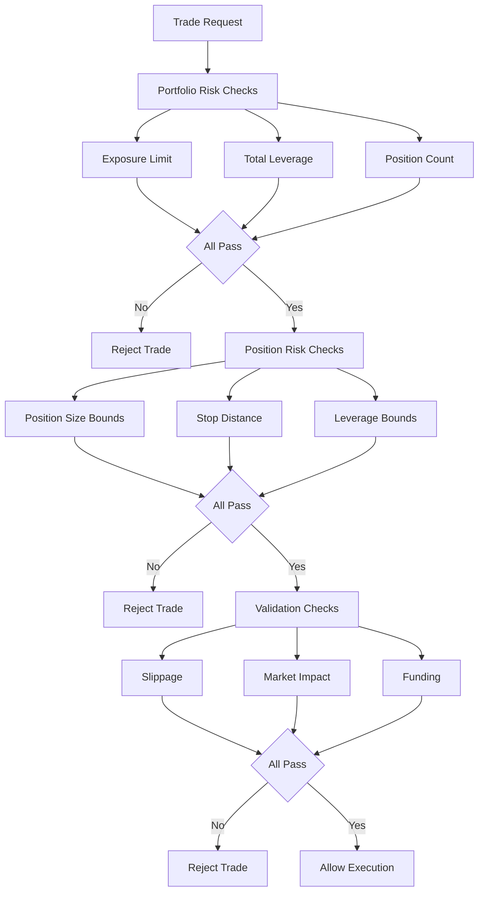
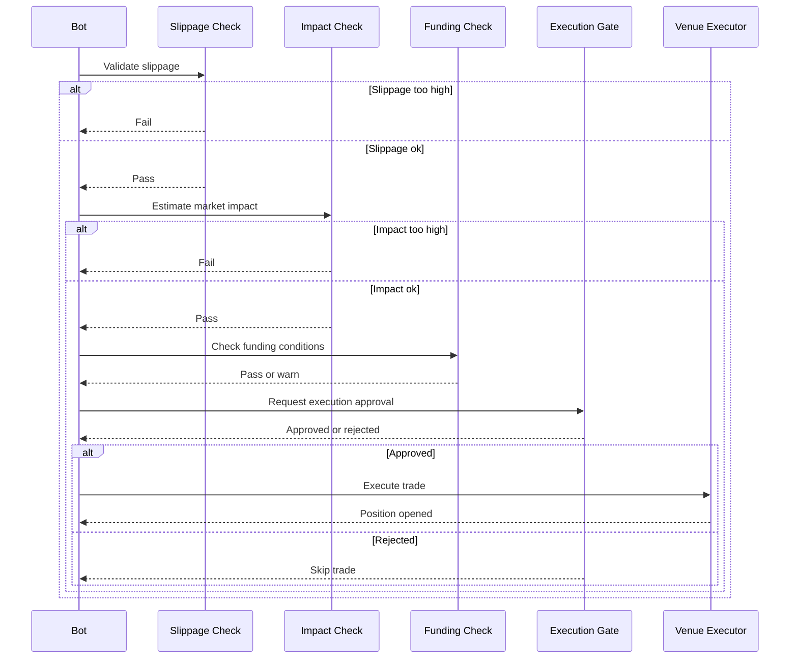
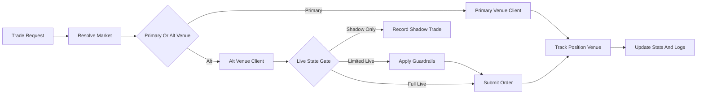
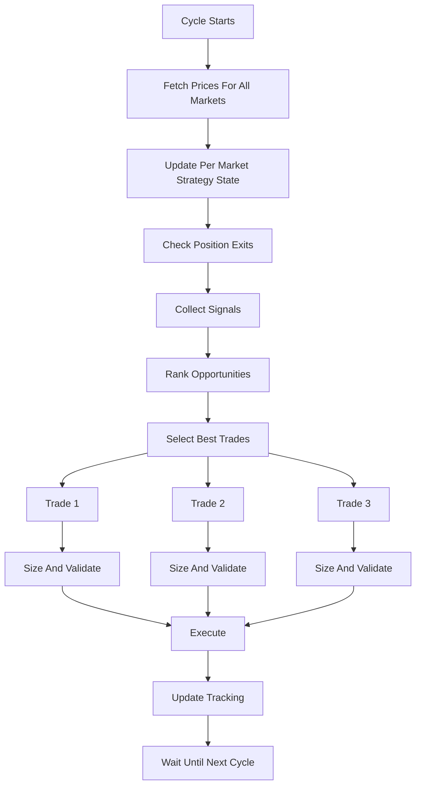

# System Diagrams

## 1. End-to-End Trading Flow

## 2. Main Trading Loop

## 3. Strategy Signal Generation

## 4. Market Ranking And Selection

## 5. Strategy-Aware Risk Hierarchy

## 6. Pre-Trade Validation Pipeline

## 7. Venue-Aware Execution

## 8. Multi-Market Execution

