# System Diagrams

This file is the canonical architecture and flow reference for the trading engine. It renders natively on GitHub and is the **single source of truth** for diagrams: the [Product Requirements Document](../docs/PRD.md) and [Engineering Requirements Document](../docs/ERD.md) embed focused excerpts, and the local `view-diagrams.html` viewer renders this file directly.

Terminology is shared across all documents. Solana-based venues are named explicitly (**Jupiter** and **Drift**, the latter through an isolated subprocess), strategy families and the five execution modes match the runtime, and the SQLite operational store is referenced by its real tables.

**Contents**

- **Part 1 — System and Architecture:** context, layers, runtime components
- **Part 2 — Orchestration and Lifecycle:** end-to-end flow, main loop, multi-market execution
- **Part 3 — Signals, Allocation, and Risk:** signal generation, allocation, risk hierarchy, validation
- **Part 4 — Execution and Venues:** venue-aware routing, staged execution modes
- **Part 5 — Subsystems, Data, and Operations:** copy-trading, persistence, security, operator controls

---

## Part 1 — System and Architecture

### 1. System Context

Who and what the runtime talks to: human actors, the Solana network, market-data sources, and the perpetuals venues. Research tooling reuses the same strategy and risk logic to limit live/backtest drift.

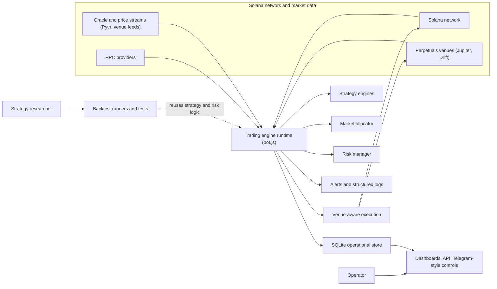

### 2. Layered Architecture

The engine keeps concerns in separate layers so network access, strategy logic, risk, execution, persistence, and operator controls do not bleed into each other. Security and secrets handling is cross-cutting, and research reuses production logic.

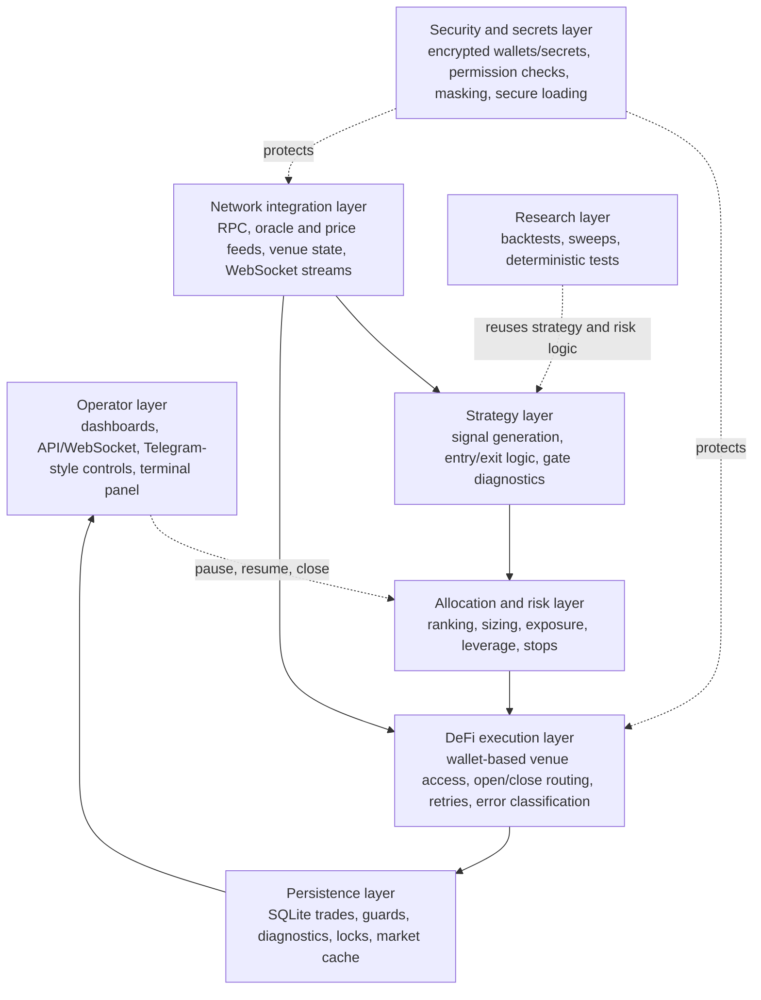

### 3. Runtime Component Architecture

The concrete modules in a running process: configuration and feeds initialize the loop, the strategy factory produces candidate signals, the allocator and risk manager select and size trades, validation gates them, and the venue-aware executor routes to Jupiter or Drift while persisting lifecycle state for the operator surfaces.

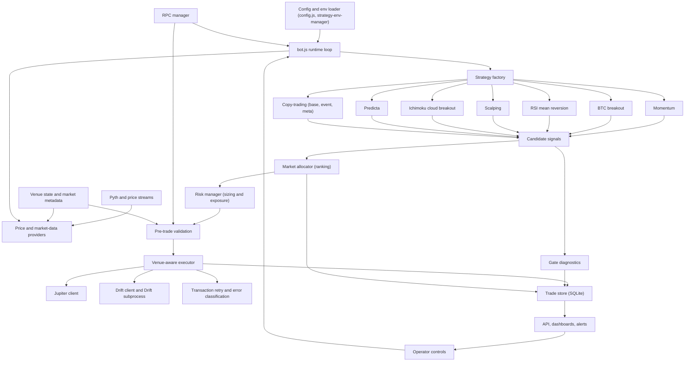

---

## Part 2 — Orchestration and Lifecycle

### 4. End-to-End Trading Lifecycle

From market data to execution, persistence, monitoring, and operator control. Closes route back to the venue that opened the position, and the dashboard/operator surfaces feed back into the loop.

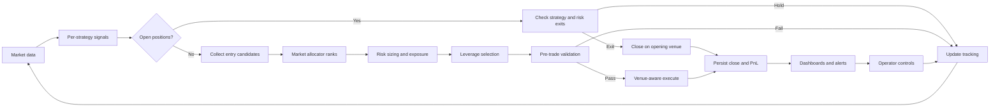

### 5. Main Trading Loop

The per-cycle sequence across the major subsystems, including validation, persistence, and status streaming. Rejected candidates still record gate and allocator diagnostics for review.

```mermaid
sequenceDiagram
  participant Loop as Trading loop (bot.js)
  participant Data as Price and market data
  participant Strat as Strategy factory
  participant Alloc as Allocator
  participant Risk as Risk manager
  participant Val as Validation
  participant Exec as Venue-aware executor
  participant Store as Trade store
  participant Ops as Dashboards and alerts

  loop Every cycle
    Loop->>Data: Refresh prices and indicators
    Data-->>Loop: Normalized market state
    Loop->>Strat: Evaluate enabled strategies
    Strat-->>Loop: Signals by market
    Loop->>Loop: Check open positions and exits
    Loop->>Alloc: Rank opportunities
    Alloc-->>Loop: Selected candidates
    loop For each selected trade
      Loop->>Risk: Size and check exposure
      Risk-->>Loop: Approved sizing or rejection
      alt Approved
        Loop->>Val: Slippage, funding, collateral, duplicate checks
        Val-->>Loop: Execution approval
        Loop->>Exec: Open or close request
        Exec->>Store: Persist lifecycle result
        Store-->>Ops: Stream status and alerts
      else Rejected
        Loop->>Store: Record gate and allocator diagnostics
      end
    end
  end
```

### 6. Multi-Market Parallel Execution

Signals from every enabled market are evaluated together; only the best candidates under portfolio limits are sized, validated, and routed.

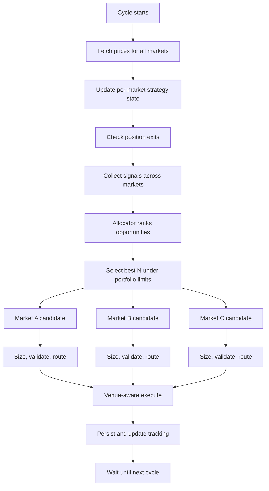

---

## Part 3 — Signals, Allocation, and Risk

### 7. Strategy Signal Generation

Signal logic is multi-factor and position-aware. Each strategy waits for warm-up, then either manages an open position (exit, pyramid, or hold) or evaluates long/short entry gates across trend, momentum, volume, volatility, cooldown, and higher-timeframe context.

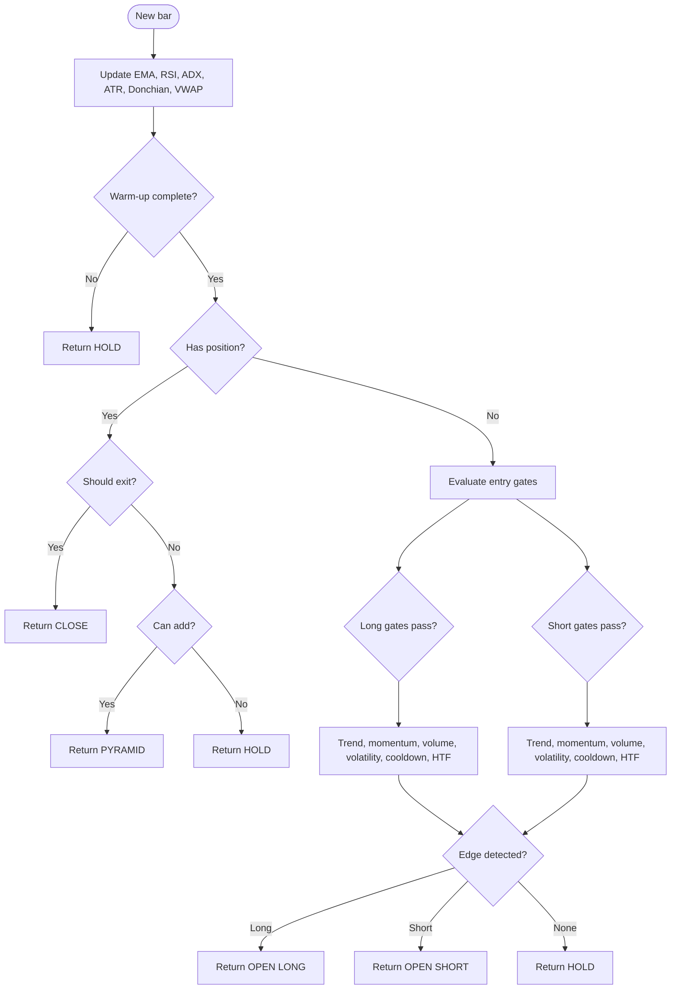

### 8. Strategy- and Market-Aware Allocation

The allocator is dynamic, not round-robin. It builds features from the candidate signal, the strategy profile, and market/venue/portfolio/history context, scores with strategy-aware weights, applies constraint and correlation overlays, then emits a ranked recommendation (size, leverage, stop, rank tilt) plus diagnostics — while final approval stays in the risk manager.

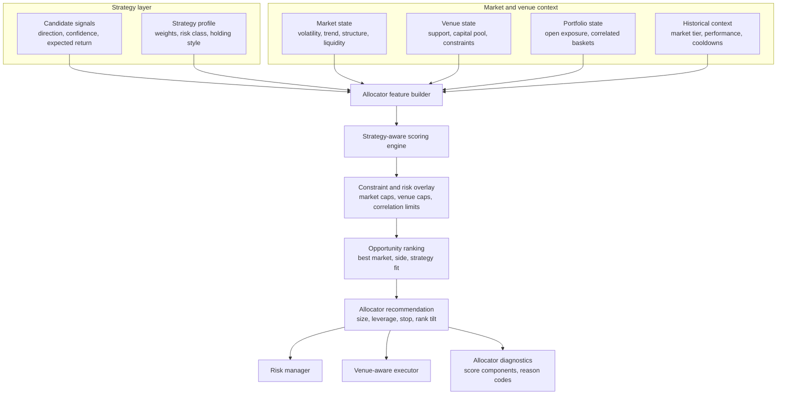

### 9. Strategy-Aware Risk Hierarchy

Risk is enforced in tiers. Portfolio-level checks run first, then strategy-aware position-level checks, then execution-quality validation. A failure at any tier rejects the trade.

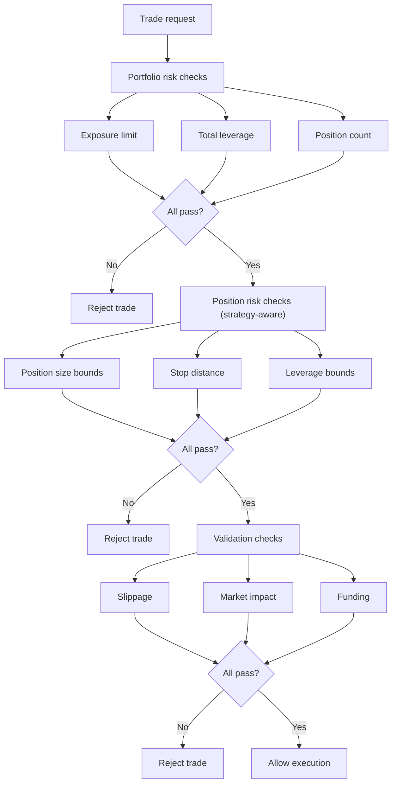

### 10. Pre-Trade Validation Pipeline

Before any live order, the request runs a fail-closed gauntlet: price freshness and network readiness, duplicate-order guard, collateral and margin, slippage, market impact, funding, and the execution-mode gate. Any unsafe condition skips the trade rather than guessing.

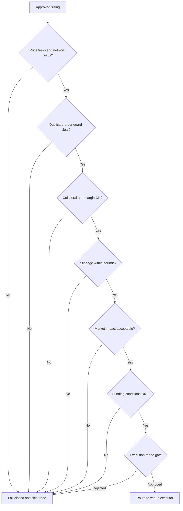

---

## Part 4 — Execution and Venues

### 11. Venue-Aware Execution and Routing

Opens select a venue by market support; closes route back to the venue that opened the position using venue metadata. Drift runs through an isolated SDK subprocess. The execution-mode gate decides whether the order is simulated, approval-gated, shadowed, capped, or fully live, and transaction results are classified for retry or state reconciliation.

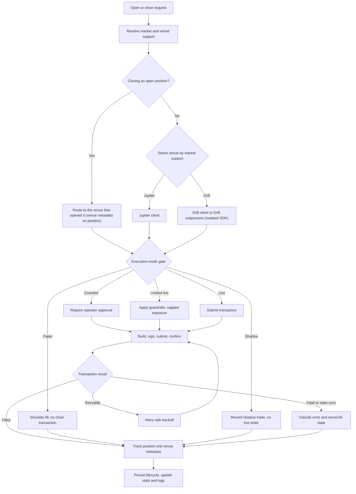

### 12. Staged Execution Modes

Execution modes form an explicit rollout ladder. Each mode is gated and selected by configuration so strategy and execution changes can be validated before full live exposure, with no accidental escalation between modes.

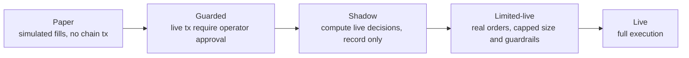

---

## Part 5 — Subsystems, Data, and Operations

### 13. Copy-Trading Subsystem

Copy-trading is a self-contained signal source. Leader-wallet activity is streamed in, a cohort is selected, a consensus engine measures agreement, and event and meta models plus a market-confluence check produce signals that flow into the same shared allocator. Cohort state is snapshotted to SQLite.

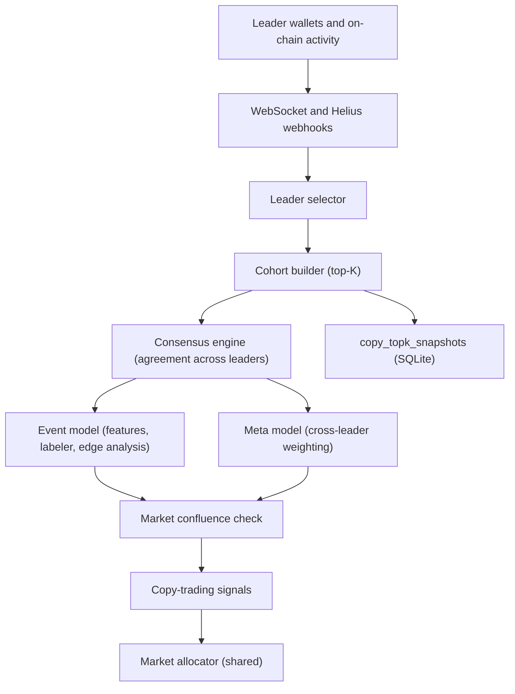

### 14. Persistence and Data Model

The runtime uses a lightweight SQLite operational store rather than a full relational domain model. The executor, strategy gates, allocator, copy-trading, and the loop write distinct tables; operator and review surfaces read them.

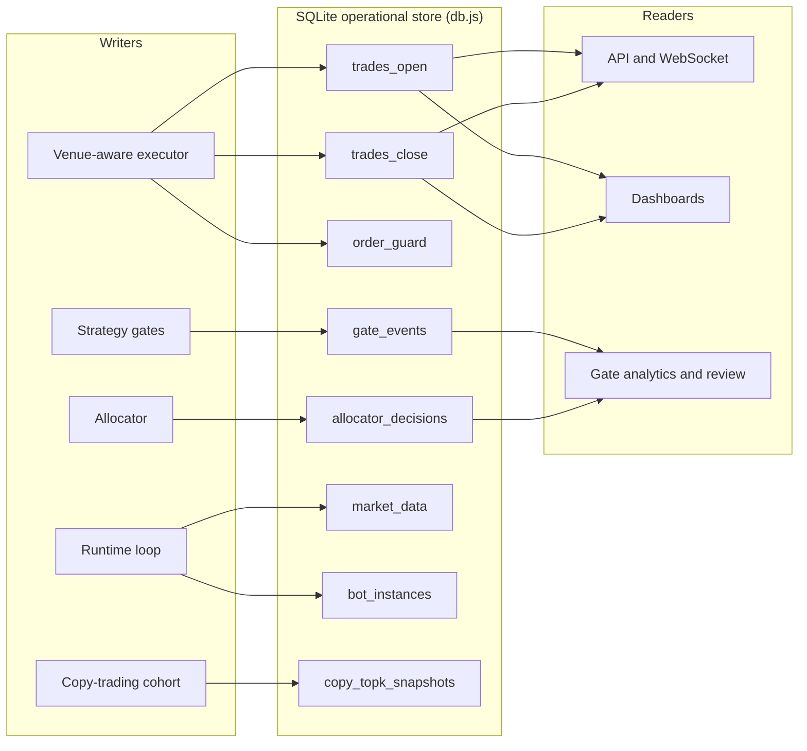

### 15. Security and Secrets Operations

Wallet and credential material is treated as production infrastructure. Files are encrypted at rest with authenticated encryption and password-derived keys, permission-checked, loaded through secure paths, masked in operator tooling, and never written to logs or passed through IPC. Public env templates carry structure only, never values.

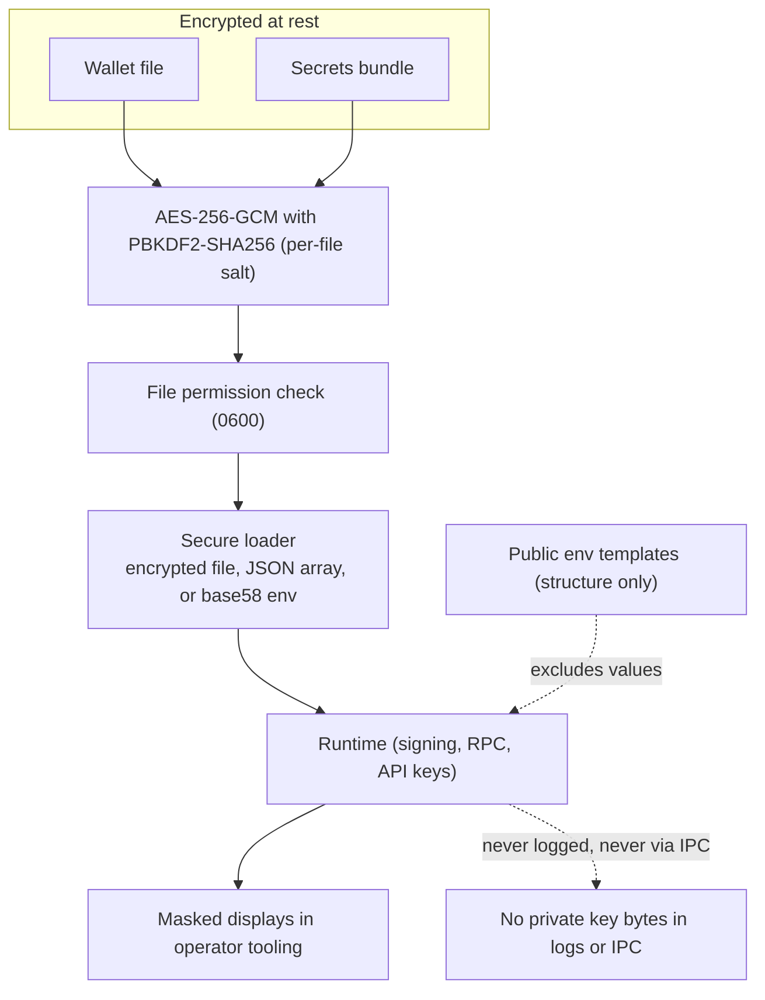

### 16. Operator Control Surface

Operators supervise and intervene without shell access. Control surfaces share authentication, rate limiting, and payload validation, then drive runtime actions — pause/resume, close position(s), and read-only inspection — while live state streams back to the surfaces. The full Telegram command tree is documented in the [README](../README.md).

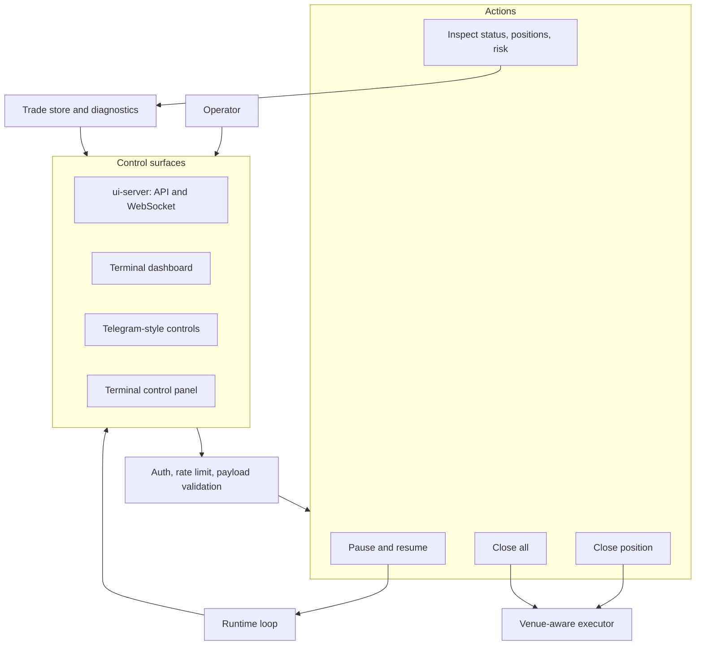
