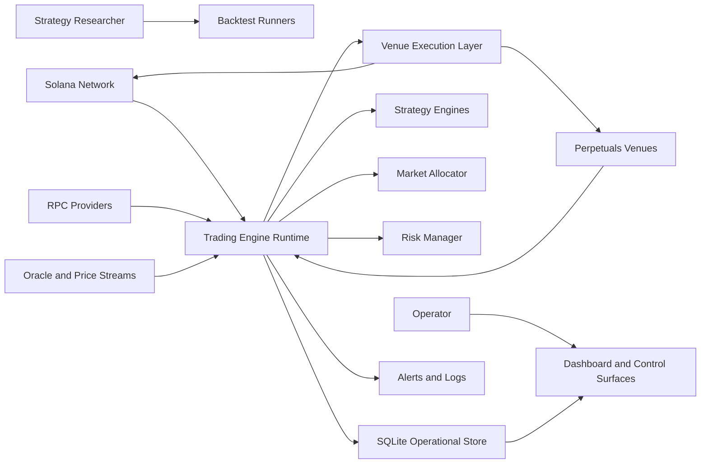
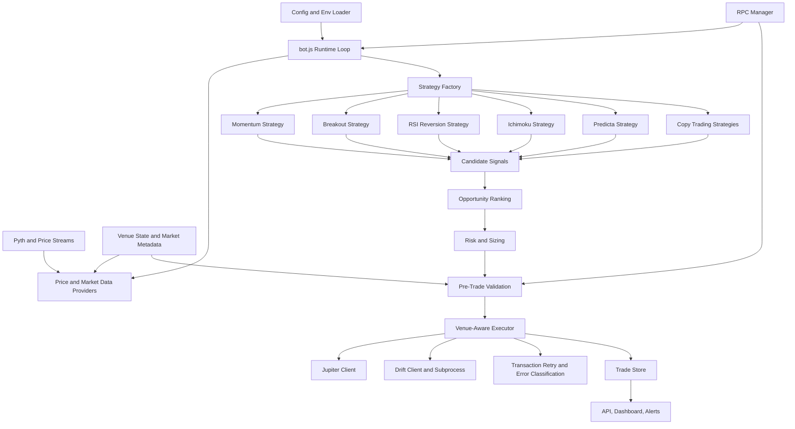
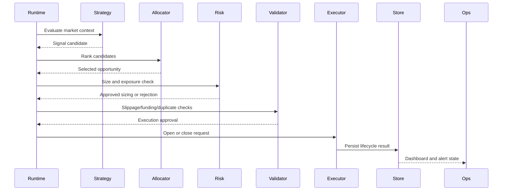

# Engineering Requirements Document

## Engineering Summary

The Solana Network Trading Engine is an event-driven DeFi network application that combines off-chain strategy decisioning with Solana-facing market data, venue routing, transaction execution, and operator controls. It evaluates multiple strategy engines, ranks opportunities across markets, applies portfolio-aware risk controls, routes execution across venue-specific clients, and exposes operational monitoring for live supervision and research iteration.

This document describes the engineering design, runtime boundaries, network/application integrations, major modules, non-functional requirements, and acceptance criteria for the public showcase snapshot.

The system should be evaluated as a multi-market Solana network application, not as a single-market trading script. The core engineering problem is coordinating strategy logic, network state, venue-specific execution behavior, risk controls, and observability without allowing those concerns to bleed into each other.

## Engineering Goals

- Establish clear boundaries between Solana network access, venue clients, strategy evaluation, portfolio/risk controls, persistence, and operator surfaces.
- Preserve a DeFi-native execution boundary where wallet-controlled Solana access replaces centralized exchange account custody.
- Keep strategy logic modular so multiple strategy families can run in the same process without configuration bleed.
- Separate signal generation, allocation, risk management, execution routing, persistence, and operator controls.
- Make trading decisions auditable through structured logs, database records, gate diagnostics, allocator decisions, and tests.
- Support both research workflows and production-like runtime workflows from the same source structure.
- Support staged execution rollout through paper, guarded, shadow, limited-live, and live-oriented modes.
- Keep public showcase source reviewable while excluding private credentials, wallet material, runtime databases, logs, and generated results.

## System Context

## Application And Network Boundaries

| Layer                     | Responsibility                                                                                       | Engineering Notes                                                                                                                   |
| ------------------------- | ---------------------------------------------------------------------------------------------------- | ----------------------------------------------------------------------------------------------------------------------------------- |
| Operator layer            | Dashboards, API/WebSocket status, Telegram-style controls, terminal control panel                    | Human actions must be authenticated, logged, and kept separate from strategy decision logic.                                        |
| Strategy layer            | Signal generation, entry/exit logic, diagnostics                                                     | Strategy modules should produce explicit decisions and diagnostic context without directly submitting transactions.                 |
| Allocation/risk layer     | Opportunity ranking, position sizing, exposure checks, stop logic, leverage controls                 | This layer owns portfolio constraints and must reject invalid opportunities before execution.                                       |
| Network integration layer | RPC access, price/oracle feeds, venue market state, WebSocket streams                                | Network state should be normalized before it influences strategy or execution decisions.                                            |
| DeFi execution layer      | Wallet-based venue access, open/close routing, transaction submission, retries, error classification | Execution clients should hide venue differences behind normalized lifecycle results without requiring centralized exchange custody. |
| Persistence layer         | Trade lifecycle, diagnostics, order guards, runtime locks, cached market state                       | Persistence supports auditability, duplicate-order prevention, and operator visibility.                                             |
| Research layer            | Backtests, strategy sweeps, execution simulations, deterministic tests                               | Research tooling should reuse production strategy/risk logic where practical to reduce drift.                                       |

## Runtime Architecture

## Repository Boundaries

| Area                  | Responsibility                                                                                                                                                     | Primary Paths                                                                                                                         |
| --------------------- | ------------------------------------------------------------------------------------------------------------------------------------------------------------------ | ------------------------------------------------------------------------------------------------------------------------------------- |
| Runtime orchestration | Process startup, strategy loading, loop control, signal evaluation, position lifecycle                                                                             | `bot.js`, `config.js`, `src/core/validate-config.js`                                                                                  |
| Strategies            | Independent signal engines and entry/exit logic                                                                                                                    | `src/strategies/`                                                                                                                     |
| Allocation and risk   | Opportunity ranking, position sizing, exposure controls, leverage selection                                                                                        | `risk-manager.js`, `utils/market-allocator.js`, `utils/portfolio-risk.js`, `utils/dynamic-leverage.js`                                |
| Network and execution | RPC management, oracle/price feeds, venue-specific order routing, guarded execution, Drift/Jupiter clients, and adapter boundaries for additional DeFi venue types | `src/execution/`, `drift-subprocess/`, `utils/rpc-manager.js`, `utils/pyth-websocket-client.js`, `utils/improved-multi-price-feed.js` |
| Operations            | API server, dashboards, Telegram-style controls, logs, journaling                                                                                                  | `src/operations/`, `src/core/logger.js`, `src/core/journal.js`                                                                        |
| Persistence           | Operational trade and diagnostics store                                                                                                                            | `db.js`                                                                                                                               |
| Research              | Backtest runners, backtest helper library, targeted tests                                                                                                          | `scripts/backtest/`, `tests/`                                                                                                         |
| Configuration         | Public market metadata and sanitized env templates                                                                                                                 | `config/`                                                                                                                             |

## Technical Innovations

| Innovation Area            | Description                                                                                                                                                                                                    | Why It Matters                                                                                                |
| -------------------------- | -------------------------------------------------------------------------------------------------------------------------------------------------------------------------------------------------------------- | ------------------------------------------------------------------------------------------------------------- |
| Strategy-isolated runtime  | Multiple strategy families run in one process while preserving strategy-specific configuration, parameters, and diagnostics.                                                                                   | Prevents config bleed and makes the engine extensible without duplicating runtime code.                       |
| Portfolio-aware allocation | Candidate signals are ranked against portfolio state, market constraints, confidence, and capacity before risk sizing.                                                                                         | Avoids treating each market signal independently when capital and exposure are shared.                        |
| DeFi-native access         | Execution is wallet-based and can connect to multiple Solana venues without centralized exchange account infrastructure.                                                                                       | Improves access, keeps custody outside centralized exchanges, and makes venue expansion configuration-driven. |
| Venue adapter architecture | Current showcase paths include Drift/Jupiter, with a normalized boundary for additional DeFi venue types such as dYdX-style perps or AMM-style venues such as PancakeSwap where compatible adapters are added. | Keeps venue expansion separate from strategy, risk, and operator-control logic.                               |
| Venue-aware execution      | Opens and closes route through the correct venue/client, with venue metadata retained on positions.                                                                                                            | Reduces state mismatch when multiple Solana execution paths are available.                                    |
| Staged live modes          | Paper, guarded, shadow, limited-live, and live-oriented paths support progressive rollout.                                                                                                                     | Lets strategy and execution changes be validated before full live exposure.                                   |
| Research/runtime parity    | Backtest runners and production modules share helper logic where practical.                                                                                                                                    | Reduces false confidence from research paths that diverge from live assumptions.                              |
| Operational auditability   | Gate events, allocator decisions, trade lifecycle records, logs, and dashboards are all part of the product.                                                                                                   | Makes the engine reviewable and operable rather than opaque.                                                  |

## Functional Engineering Requirements

| ID    | Requirement                    | Implementation Expectation                                                                                                                                     |
| ----- | ------------------------------ | -------------------------------------------------------------------------------------------------------------------------------------------------------------- |
| ER-0  | Network application boundaries | Runtime must keep Solana network access, venue execution, off-chain strategy logic, risk controls, and operator surfaces modular.                              |
| ER-0A | DeFi custody boundary          | Live-oriented execution should use wallet-controlled Solana venue access and avoid centralized exchange account custody.                                       |
| ER-1  | Strategy isolation             | Each strategy loads its own configuration and exposes a signal interface without mutating unrelated strategy state.                                            |
| ER-2  | Multi-strategy runtime         | The runtime can evaluate multiple enabled strategies and pass candidate opportunities into a shared allocator.                                                 |
| ER-3  | Market allocation              | The allocator scores candidates using confidence, risk, market constraints, and portfolio state before selecting trades.                                       |
| ER-4  | Strategy-aware risk            | Risk calculations support different sizing, stop, take-profit, time-stop, and leverage rules by strategy type.                                                 |
| ER-5  | Pre-trade validation           | Execution requests must pass slippage, market impact, funding, collateral, price freshness, network readiness, and duplicate-order checks before live routing. |
| ER-6  | Venue-aware routing            | Open and close requests route through the correct execution client, and the opening venue is retained for close routing.                                       |
| ER-7  | Operational persistence        | Trades, closes, order guards, diagnostics, market data, and runtime locks persist to SQLite-compatible storage.                                                |
| ER-8  | Operator controls              | Runtime state can be inspected and controlled through dashboard/API/alert surfaces.                                                                            |
| ER-9  | Research parity                | Backtest runners reuse shared helper logic and strategy modules where practical to reduce live/backtest drift.                                                 |
| ER-10 | Sanitized public snapshot      | Public source includes reviewable architecture and representative production logic without private runtime values.                                             |
| ER-11 | Network failure classification | RPC, stream, stale-price, transaction, and venue-state failures should be classified so the runtime can retry, degrade, or fail closed appropriately.          |
| ER-12 | Execution-mode safety          | Paper, guarded, shadow, limited-live, and live-oriented modes must have explicit behavior and avoid accidental mode escalation.                                |

## Non-Functional Engineering Requirements

| Category        | Requirement                                                                                                                      |
| --------------- | -------------------------------------------------------------------------------------------------------------------------------- |
| Safety          | Live execution must be gated behind explicit execution mode, risk checks, duplicate-order guards, and venue-specific validation. |
| Reliability     | Optional services should fail closed or degrade safely where possible, especially around price feeds and execution state.        |
| Observability   | Strategy gates, allocator decisions, trade lifecycle events, errors, and operator actions should be inspectable.                 |
| Maintainability | Strategy, execution, operations, and research code should remain grouped by responsibility.                                      |
| Testability     | Core risk, allocator, strategy, venue-routing, config, and backtest utility paths should have targeted tests.                    |
| Security        | Secrets, private keys, RPC credentials, API keys, wallet material, databases, and logs must remain outside public source.        |
| Portability     | Runtime should support local review, paper mode, and hosted deployment with environment-backed configuration.                    |

## Network Integration Requirements

| Integration                  | Requirement                                                                                                                                 |
| ---------------------------- | ------------------------------------------------------------------------------------------------------------------------------------------- |
| Solana RPC                   | Use configurable RPC paths, classify connection/transaction failures, and avoid hardcoding private endpoints.                               |
| Price and oracle feeds       | Validate price freshness and provide source-specific fallback behavior where safe.                                                          |
| DeFi venue clients           | Normalize open/close lifecycle results across Solana-based venues while preserving metadata required for close routing.                     |
| Additional venue adapters    | Keep venue-specific protocol integrations behind normalized adapters so new DeFi venues can be added without rewriting strategy/risk logic. |
| Wallet-controlled execution  | Require wallet configuration for live-oriented execution without requiring centralized exchange credentials.                                |
| WebSocket streams            | Treat stream disconnects and stale updates as observable health events.                                                                     |
| Transaction handling         | Support retry classification and avoid duplicate submissions through client/order guards.                                                   |
| Margin and collateral checks | Validate available collateral, liquidation risk, leverage, and venue constraints before live-oriented execution.                            |
| Operator APIs                | Expose health and control actions without coupling API handlers to strategy internals.                                                      |

## Data And State Requirements

The system uses a lightweight operational store for runtime state rather than a full relational domain model.

Required state areas:

- Open trade lifecycle state
- Closed trade and realized PnL records
- Duplicate-order guard reservations
- Strategy gate diagnostics
- Allocator decision diagnostics
- Candle or market-data cache
- Runtime instance lock and heartbeat
- Copy-trading cohort snapshots and decision context

The public implementation for this storage layer is in `db.js`.

## Execution Flow Requirements

## Module-Level Requirements

### Runtime

- Load sanitized environment structure from shared and strategy-specific configuration files.
- Initialize price providers, strategy factory, risk manager, execution clients, persistence, and operations surfaces.
- Prevent conflicting runtime instances where configured.
- Continue operating in paper/research modes without requiring live wallet material.

### Strategy Engines

- Produce explicit `open`, `close`, or `hold` decisions.
- Include enough diagnostic context to explain rejected or accepted signals.
- Keep market-specific overrides isolated by strategy and symbol.
- Avoid lookahead bias in backtest-oriented code paths.

### Risk And Allocation

- Compute position size from strategy type, portfolio exposure, leverage settings, and market constraints.
- Reject trades that exceed total exposure, per-market exposure, leverage limits, or position count.
- Preserve strategy-specific exit behavior while supporting global safety exits.

### Execution

- Route by configured venue and market support.
- Track venue metadata for open positions.
- Support paper, guarded, shadow, limited-live, and live-oriented execution flows.
- Classify execution errors so retryable, fatal, and state-sync failures are handled differently.
- Fail closed when network state, price freshness, collateral, or duplicate-order checks are unsafe.

### Operations

- Expose current positions, recent actions, health, and trade status.
- Provide pause/resume and close-position control paths.
- Emit alerts for runtime, execution, stale data, and connectivity issues.
- Keep operator-facing controls separate from strategy decision logic.

### Research And Backtesting

- Keep runnable backtests and shared backtest utilities under `scripts/backtest/`.
- Keep deterministic tests in `tests/` and `scripts/backtest/lib/__tests__/`.
- Support strategy-specific backtest entry points without requiring private datasets in the public repo.

## Interface Requirements

| Interface                  | Direction    | Requirement                                                                                      |
| -------------------------- | ------------ | ------------------------------------------------------------------------------------------------ |
| Environment config         | Input        | Public templates must show field structure only; real values must remain private.                |
| Market data providers      | Input        | Runtime must tolerate source-specific failure and use configured fallback behavior.              |
| Solana RPC                 | Input/Output | Runtime must read network state and submit transactions through configurable, private endpoints. |
| Oracle and WebSocket feeds | Input        | Runtime must validate freshness and disconnect state before using data for trading decisions.    |
| Strategy factory           | Internal     | Strategy creation must be driven by enabled strategy configuration.                              |
| Risk manager               | Internal     | Must return explicit approvals/rejections and sizing metadata.                                   |
| Venue executor             | Output       | Must normalize open/close behavior across venue clients.                                         |
| SQLite store               | Internal     | Must preserve trade lifecycle, diagnostics, and runtime state.                                   |
| Dashboard/API              | Output/Input | Must expose status and accept operator control commands where enabled.                           |

## Acceptance Criteria

- Repository root remains small and focused on core entry/config files.
- Non-core runtime modules are grouped under `src/`.
- Backtest runners and backtest helper libraries are grouped under `scripts/backtest/`.
- Environment templates exist under `config/env-templates/`, with strategy-specific templates grouped under `config/env-templates/strategy-env/`.
- README links point to the PRD, engineering ERD, diagrams, and sanitization notes.
- Relative imports resolve after structural moves.
- Included tests and syntax checks pass for touched paths.

## Engineering Risks And Mitigations

| Risk                              | Mitigation                                                                                                |
| --------------------------------- | --------------------------------------------------------------------------------------------------------- |
| Strategy configuration bleed      | Use strategy-specific env loading and explicit strategy factory boundaries.                               |
| Live/backtest divergence          | Share strategy and helper modules where practical and keep backtest assumptions visible.                  |
| Duplicate or conflicting orders   | Use order guards, client order IDs, and persisted lifecycle state.                                        |
| Venue state mismatch              | Store venue metadata on open positions and route closes through the original venue.                       |
| Network or price-feed degradation | Classify RPC/stream failures, validate price freshness, and fail closed when execution context is unsafe. |
| Secret exposure in showcase       | Use sanitized templates, exclude runtime files, and audit generated files for assigned values.            |
| Overloaded root structure         | Keep root for core files and group source, docs, config, tests, scripts, and tools in subdirectories.     |
