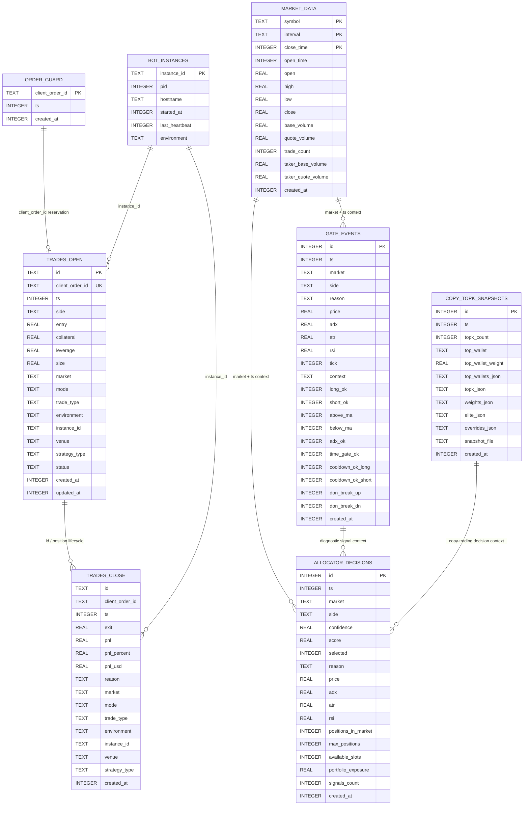
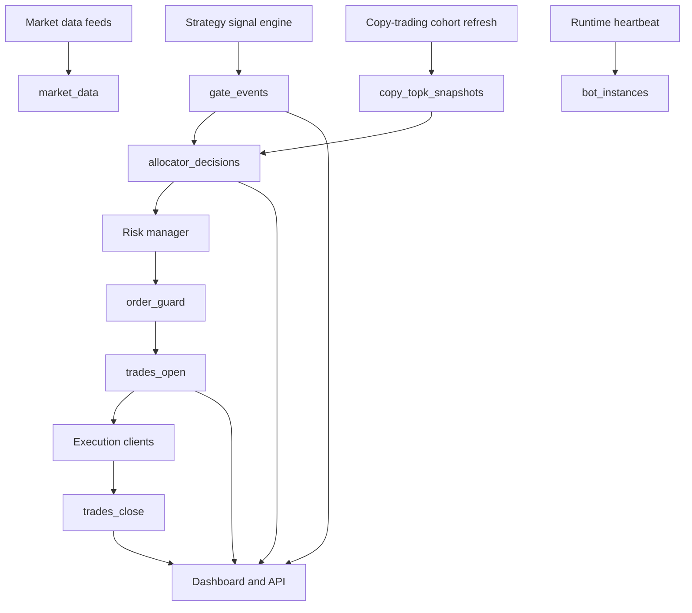

# Entity Relationship Diagram

## Overview

The system uses SQLite as an operational store for trade lifecycle tracking, duplicate order protection, market-data caching, strategy diagnostics, allocator decisions, instance locking, and copy-trading cohort snapshots.

The schema is implemented in [db.js](../db.js). Most relationships are logical rather than enforced foreign keys because the bot prioritizes lightweight local persistence, backwards-compatible migrations, and runtime resilience.

## High-Level ERD

## Runtime Data Flow

## Entity Catalog

### `trades_open`

Tracks active or pending positions. A row is created when an order is accepted into the bot lifecycle and is updated as execution details become available.

Primary key:

- `id`: position identifier

Important fields:

- `client_order_id`: unique order identifier used to connect order reservation and execution
- `ts`: position open timestamp
- `side`: `long` or `short`
- `entry`: entry price
- `collateral`, `leverage`, `size`: position sizing fields
- `market`: traded market symbol
- `mode`: paper/live execution mode
- `trade_type`: automated/manual classification
- `venue`: execution venue classification
- `strategy_type`: strategy responsible for the trade
- `status`: pending/filled tracking for maker-order flows

Indexes:

- `trades_open_client_order_id_idx` unique index on `client_order_id`

### `trades_close`

Stores position close events and realized performance. Rows are inserted when a position exits, and the corresponding `trades_open` row is deleted by the close logger.

Logical relationship:

- `trades_close.id` maps to `trades_open.id`
- `trades_close.client_order_id` maps to the original order reservation where available

Important fields:

- `exit`: exit price
- `pnl`: legacy normalized PnL value
- `pnl_percent`: PnL stored as a percentage when available
- `pnl_usd`: absolute PnL when collateral is known
- `reason`: close reason, such as stop loss, take profit, strategy exit, time stop, or manual close
- `market`, `mode`, `trade_type`, `venue`, `strategy_type`: close-side classification

### `order_guard`

Prevents duplicate order submission by reserving a `client_order_id` before execution.

Primary key:

- `client_order_id`

Lifecycle:

- Inserted before execution
- Released when an order is abandoned
- Linked logically to `trades_open.client_order_id`

### `gate_events`

Captures strategy-level signal diagnostics. These rows explain why entry gates passed or failed.

Important fields:

- `market`, `side`, `reason`
- `price`, `adx`, `atr`, `rsi`
- `long_ok`, `short_ok`
- `above_ma`, `below_ma`
- `adx_ok`, `time_gate_ok`
- `cooldown_ok_long`, `cooldown_ok_short`
- `don_break_up`, `don_break_dn`
- `context`: JSON payload with additional strategy context

Usage:

- Dashboard gate analysis
- Strategy debugging
- Backtest/live parity checks
- Signal bottleneck analysis

### `allocator_decisions`

Stores market allocator decisions after candidate signals are scored and ranked.

Important fields:

- `market`, `side`
- `confidence`, `score`
- `selected`: whether the candidate was selected for execution
- `reason`: selected or rejected rationale
- `positions_in_market`, `max_positions`, `available_slots`
- `portfolio_exposure`, `signals_count`

Usage:

- Explains why the bot selected one opportunity over another
- Supports debugging portfolio constraints and market ranking
- Connects strategy outputs to actual execution decisions

### `market_data`

Stores OHLCV candles used for warmup, backtesting, and cached market-data access.

Composite primary key:

- `symbol`
- `interval`
- `close_time`

Index:

- `market_data_symbol_interval_time_idx` on `(symbol, interval, close_time)`

Important fields:

- `open_time`, `close_time`
- `open`, `high`, `low`, `close`
- `base_volume`, `quote_volume`
- `trade_count`
- `taker_base_volume`, `taker_quote_volume`

### `bot_instances`

Prevents conflicting bot processes and records runtime heartbeat state.

Primary key:

- `instance_id`

Index:

- `bot_instances_last_heartbeat_idx` on `last_heartbeat`

Important fields:

- `pid`, `hostname`, `environment`
- `started_at`, `last_heartbeat`

Usage:

- Instance locking
- Runtime health checks
- Multi-environment safety

### `copy_topk_snapshots`

Stores copy-trading cohort snapshots and leader-weight metadata used by copy-trading strategy variants.

Index:

- `copy_topk_snapshots_ts_idx` on `ts`

Important fields:

- `topk_count`
- `top_wallet`, `top_wallet_weight`
- `top_wallets_json`
- `topk_json`, `weights_json`, `elite_json`, `overrides_json`
- `snapshot_file`

Usage:

- Reconstruct copy-trading leader state
- Audit copy-trading model inputs
- Compare cohort quality over time

## Logical Relationships

| Source | Target | Key | Purpose |
| --- | --- | --- | --- |
| `order_guard` | `trades_open` | `client_order_id` | Prevent duplicate order submission |
| `trades_open` | `trades_close` | `id` | Position lifecycle from open to close |
| `bot_instances` | `trades_open` | `instance_id` | Attribute trades to runtime instance |
| `bot_instances` | `trades_close` | `instance_id` | Attribute closes to runtime instance |
| `market_data` | `gate_events` | `market/symbol`, `ts` | Explain signal state using candle context |
| `gate_events` | `allocator_decisions` | `market`, `side`, `ts` | Connect signal gates to allocator outcomes |
| `copy_topk_snapshots` | `allocator_decisions` | `ts` window | Connect copy-trading cohort state to allocation |

## Migration Strategy

The database uses idempotent schema setup:

- `CREATE TABLE IF NOT EXISTS` creates base tables.
- `CREATE INDEX IF NOT EXISTS` creates performance indexes safely.
- `ensureColumn(table, column, ddl)` adds new columns without destructive migrations.
- Query code checks column existence for backwards compatibility with older databases.

This keeps local, Render, and historical database files usable as the bot evolves.

