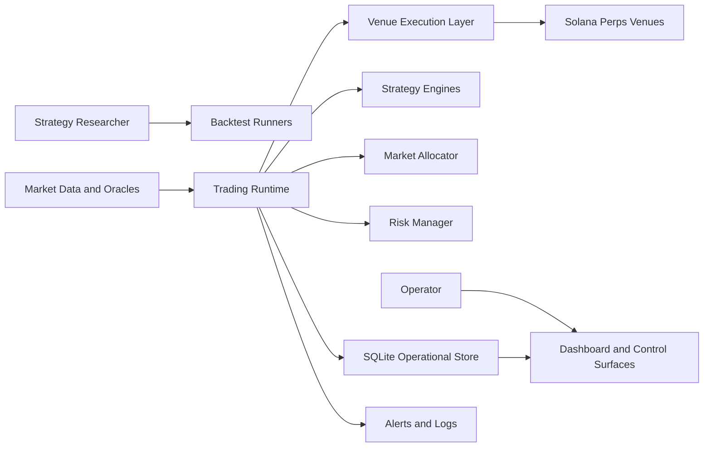
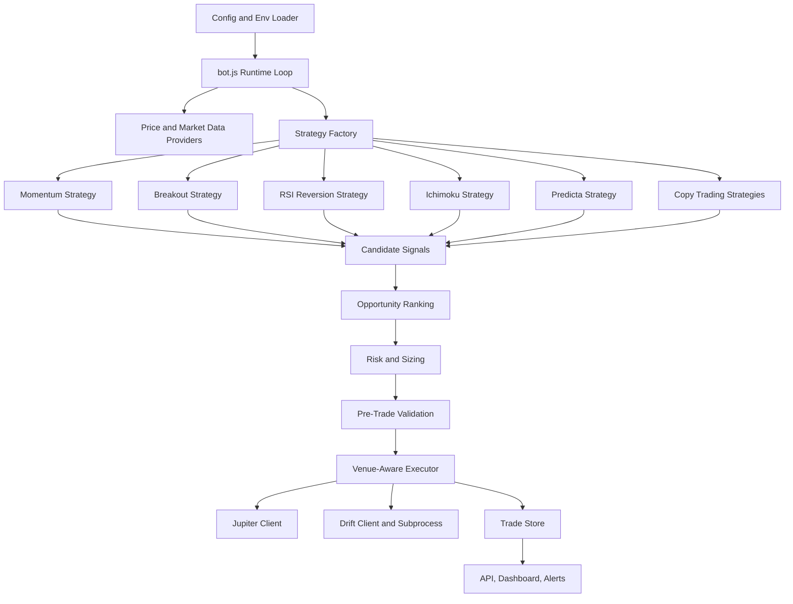
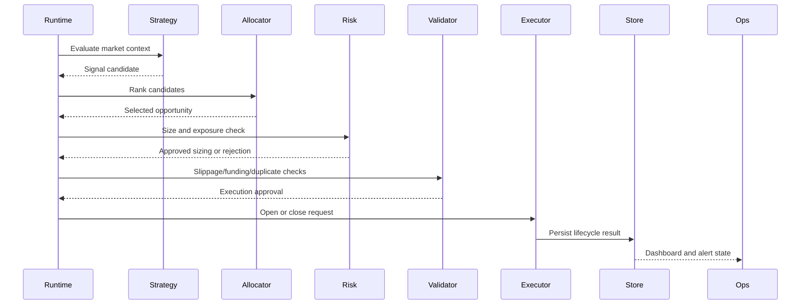

# Engineering Requirements Document

## Engineering Summary

The Solana Automated Trading System is an event-driven trading runtime that evaluates multiple strategy engines, ranks opportunities, applies risk controls, routes execution across venue-specific clients, and exposes operational monitoring for live supervision and research iteration.

This document describes the engineering design, runtime boundaries, major modules, non-functional requirements, and acceptance criteria for the public showcase snapshot.

## Engineering Goals

- Keep strategy logic modular so multiple strategy families can run in the same process without configuration bleed.
- Separate signal generation, allocation, risk management, execution routing, persistence, and operator controls.
- Make trading decisions auditable through structured logs, database records, gate diagnostics, allocator decisions, and tests.
- Support both research workflows and production-like runtime workflows from the same source structure.
- Keep public showcase source reviewable while excluding private credentials, wallet material, runtime databases, logs, and generated results.

## System Context

## Runtime Architecture

## Repository Boundaries

| Area | Responsibility | Primary Paths |
| --- | --- | --- |
| Runtime orchestration | Process startup, strategy loading, loop control, signal evaluation, position lifecycle | `bot.js`, `config.js`, `src/core/validate-config.js` |
| Strategies | Independent signal engines and entry/exit logic | `src/strategies/` |
| Allocation and risk | Opportunity ranking, position sizing, exposure controls, leverage selection | `risk-manager.js`, `utils/market-allocator.js`, `utils/portfolio-risk.js`, `utils/dynamic-leverage.js` |
| Execution | Venue-specific order routing, guarded execution, Drift/Jupiter clients | `src/execution/`, `drift-subprocess/` |
| Operations | API server, dashboards, Telegram-style controls, logs, journaling | `src/operations/`, `src/core/logger.js`, `src/core/journal.js` |
| Persistence | Operational trade and diagnostics store | `db.js` |
| Research | Backtest runners, backtest helper library, targeted tests | `scripts/backtest/`, `tests/` |
| Configuration | Public market metadata and sanitized env templates | `config/` |

## Functional Engineering Requirements

| ID | Requirement | Implementation Expectation |
| --- | --- | --- |
| ER-1 | Strategy isolation | Each strategy loads its own configuration and exposes a signal interface without mutating unrelated strategy state. |
| ER-2 | Multi-strategy runtime | The runtime can evaluate multiple enabled strategies and pass candidate opportunities into a shared allocator. |
| ER-3 | Market allocation | The allocator scores candidates using confidence, risk, market constraints, and portfolio state before selecting trades. |
| ER-4 | Strategy-aware risk | Risk calculations support different sizing, stop, take-profit, time-stop, and leverage rules by strategy type. |
| ER-5 | Pre-trade validation | Execution requests must pass slippage, market impact, funding, collateral, and duplicate-order checks before live routing. |
| ER-6 | Venue-aware routing | Open and close requests route through the correct execution client, and the opening venue is retained for close routing. |
| ER-7 | Operational persistence | Trades, closes, order guards, diagnostics, market data, and runtime locks persist to SQLite-compatible storage. |
| ER-8 | Operator controls | Runtime state can be inspected and controlled through dashboard/API/alert surfaces. |
| ER-9 | Research parity | Backtest runners reuse shared helper logic and strategy modules where practical to reduce live/backtest drift. |
| ER-10 | Sanitized public snapshot | Public source includes reviewable architecture and representative production logic without private runtime values. |

## Non-Functional Engineering Requirements

| Category | Requirement |
| --- | --- |
| Safety | Live execution must be gated behind explicit execution mode, risk checks, duplicate-order guards, and venue-specific validation. |
| Reliability | Optional services should fail closed or degrade safely where possible, especially around price feeds and execution state. |
| Observability | Strategy gates, allocator decisions, trade lifecycle events, errors, and operator actions should be inspectable. |
| Maintainability | Strategy, execution, operations, and research code should remain grouped by responsibility. |
| Testability | Core risk, allocator, strategy, venue-routing, config, and backtest utility paths should have targeted tests. |
| Security | Secrets, private keys, RPC credentials, API keys, wallet material, databases, and logs must remain outside public source. |
| Portability | Runtime should support local review, paper mode, and hosted deployment with environment-backed configuration. |

## Data And State Requirements

The system uses a lightweight operational store for runtime state rather than a full relational domain model.

Required state areas:

- Open trade lifecycle state
- Closed trade and realized PnL records
- Duplicate-order guard reservations
- Strategy gate diagnostics
- Allocator decision diagnostics
- Candle or market-data cache
- Runtime instance lock and heartbeat
- Copy-trading cohort snapshots and decision context

The public implementation for this storage layer is in `db.js`.

## Execution Flow Requirements

## Module-Level Requirements

### Runtime

- Load sanitized environment structure from shared and strategy-specific configuration files.
- Initialize price providers, strategy factory, risk manager, execution clients, persistence, and operations surfaces.
- Prevent conflicting runtime instances where configured.
- Continue operating in paper/research modes without requiring live wallet material.

### Strategy Engines

- Produce explicit `open`, `close`, or `hold` decisions.
- Include enough diagnostic context to explain rejected or accepted signals.
- Keep market-specific overrides isolated by strategy and symbol.
- Avoid lookahead bias in backtest-oriented code paths.

### Risk And Allocation

- Compute position size from strategy type, portfolio exposure, leverage settings, and market constraints.
- Reject trades that exceed total exposure, per-market exposure, leverage limits, or position count.
- Preserve strategy-specific exit behavior while supporting global safety exits.

### Execution

- Route by configured venue and market support.
- Track venue metadata for open positions.
- Support paper, guarded, shadow, limited-live, and live-oriented execution flows.
- Classify execution errors so retryable, fatal, and state-sync failures are handled differently.

### Operations

- Expose current positions, recent actions, health, and trade status.
- Provide pause/resume and close-position control paths.
- Emit alerts for runtime, execution, stale data, and connectivity issues.
- Keep operator-facing controls separate from strategy decision logic.

### Research And Backtesting

- Keep runnable backtests and shared backtest utilities under `scripts/backtest/`.
- Keep deterministic tests in `tests/` and `scripts/backtest/lib/__tests__/`.
- Support strategy-specific backtest entry points without requiring private datasets in the public repo.

## Interface Requirements

| Interface | Direction | Requirement |
| --- | --- | --- |
| Environment config | Input | Public templates must show field structure only; real values must remain private. |
| Market data providers | Input | Runtime must tolerate source-specific failure and use configured fallback behavior. |
| Strategy factory | Internal | Strategy creation must be driven by enabled strategy configuration. |
| Risk manager | Internal | Must return explicit approvals/rejections and sizing metadata. |
| Venue executor | Output | Must normalize open/close behavior across venue clients. |
| SQLite store | Internal | Must preserve trade lifecycle, diagnostics, and runtime state. |
| Dashboard/API | Output/Input | Must expose status and accept operator control commands where enabled. |

## Acceptance Criteria

- Repository root remains small and focused on core entry/config files.
- Non-core runtime modules are grouped under `src/`.
- Backtest runners and backtest helper libraries are grouped under `scripts/backtest/`.
- Environment templates exist under `config/env-templates/`, with strategy-specific templates grouped under `config/env-templates/strategy-env/`.
- README links point to the PRD, engineering ERD, diagrams, and sanitization notes.
- Relative imports resolve after structural moves.
- Included tests and syntax checks pass for touched paths.

## Engineering Risks And Mitigations

| Risk | Mitigation |
| --- | --- |
| Strategy configuration bleed | Use strategy-specific env loading and explicit strategy factory boundaries. |
| Live/backtest divergence | Share strategy and helper modules where practical and keep backtest assumptions visible. |
| Duplicate or conflicting orders | Use order guards, client order IDs, and persisted lifecycle state. |
| Venue state mismatch | Store venue metadata on open positions and route closes through the original venue. |
| Secret exposure in showcase | Use sanitized templates, exclude runtime files, and audit generated files for assigned values. |
| Overloaded root structure | Keep root for core files and group source, docs, config, tests, scripts, and tools in subdirectories. |
