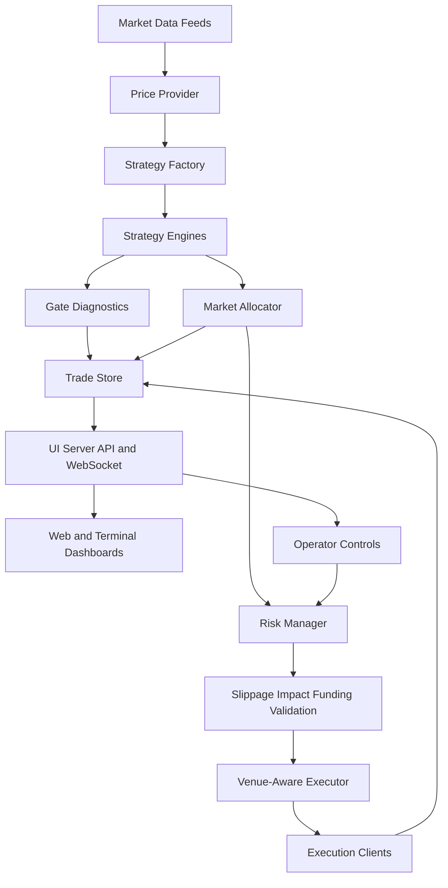

# Product Requirements Document

## Product Summary

The Solana Automated Trading System is a production trading platform that runs multiple quantitative strategies in parallel, evaluates market opportunities in real time, applies layered risk controls, executes trades through venue-specific clients, and exposes dashboards, alerts, and backtesting workflows for monitoring and iteration.

This showcase repository contains a sanitized source-code snapshot intended for technical review. It excludes private environment files, wallet material, runtime databases, logs, caches, and generated result dumps.

## Goals

- Run multiple strategy families in the same runtime without configuration bleed between strategies.
- Evaluate signals across markets, rank opportunities, and select trades under portfolio constraints.
- Apply risk controls before and after execution, including sizing, leverage bounds, stop logic, exposure limits, and duplicate-order protection.
- Route execution through the appropriate venue client while supporting paper, live, guarded, shadow, and limited-live flows.
- Provide operational visibility through dashboards, APIs, logs, Telegram-style controls, analytics tables, and backtesting tools.
- Support research iteration through deterministic backtests, strategy sweeps, and diagnostic tests.

## Non-Goals

- This showcase repository is not intended to be run as a live trading bot without private configuration, wallets, RPC endpoints, and deployment secrets.
- The public repository does not include proprietary local datasets, generated analysis outputs, or private leader-wallet configuration.
- The system does not guarantee trading profitability. It is an engineering platform for automated trading research, execution, and monitoring.

## Target Users

### Operator

The operator monitors live status, pauses or resumes trading, closes positions, reviews logs, and checks portfolio/risk state.

Needs:

- Clear runtime status
- Manual override controls
- Position and PnL visibility
- Alerts when execution or connectivity fails

### Strategy Researcher

The researcher develops, tests, and compares strategy variants.

Needs:

- Strategy-specific configuration
- Backtest runners
- Gate and allocator diagnostics
- Repeatable tests and comparable outputs

### Risk Reviewer

The reviewer checks whether the system constrains exposure and handles failures correctly.

Needs:

- Position sizing logic
- Stop and exit behavior
- Portfolio exposure checks
- Execution validation and duplicate-order guards

### Technical Reviewer

The reviewer assesses architecture, code quality, integration points, and operational depth.

Needs:

- Runtime entry points
- Strategy implementations
- Execution clients
- Test coverage
- Data model and architecture diagrams

## Core Capabilities

### Multi-Strategy Runtime

The runtime loads strategy-specific configuration and supports multiple strategy families:

- Momentum and breakout
- RSI mean reversion
- BTC breakout
- Scalping
- Predicta-style signal logic
- Ichimoku cloud breakout
- Copy-trading, event-driven copy-trading, and meta copy-trading

Primary files:

- [bot.js](../bot.js)
- [utils/strategy-factory.js](../utils/strategy-factory.js)
- [utils/strategy-env-manager.js](../utils/strategy-env-manager.js)

### Market Opportunity Ranking

The allocator evaluates signals across markets, scores candidates, applies portfolio/per-market constraints, and selects the best opportunities.

Primary files:

- [utils/market-allocator.js](../utils/market-allocator.js)
- [risk-manager.js](../risk-manager.js)
- [utils/portfolio-risk.js](../utils/portfolio-risk.js)

### Strategy-Aware Risk Management

Risk logic varies by strategy type and includes stop loss, take profit, trailing stops, time stops, position sizing, leverage constraints, and funding checks.

Primary files:

- [risk-manager.js](../risk-manager.js)
- [utils/dynamic-leverage.js](../utils/dynamic-leverage.js)
- [utils/slippage-validator.js](../utils/slippage-validator.js)
- [utils/slippage-controller.js](../utils/slippage-controller.js)

### Venue-Aware Execution

The platform routes trades by market and venue state. It tracks which venue opened a position so closes route correctly.

Supported execution states include:

- Paper mode
- Live mode
- Guarded execution
- Shadow mode
- Limited live mode

Primary files:

- [src/execution/venue-aware-trade-executor.js](../src/execution/venue-aware-trade-executor.js)
- [src/execution/perps-live-client.js](../src/execution/perps-live-client.js)
- [src/execution/perps-drift-client.js](../src/execution/perps-drift-client.js)
- [drift-subprocess/index.js](../drift-subprocess/index.js)
- [utils/venue-router.js](../utils/venue-router.js)
- [utils/limited-live.js](../utils/limited-live.js)
- [utils/shadow-mode.js](../utils/shadow-mode.js)

### Monitoring And Control

The system exposes operational status and controls through server endpoints, WebSockets, terminal dashboards, and Telegram-style controls.

Primary files:

- [src/operations/ui-server.js](../src/operations/ui-server.js)
- [src/operations/dashboard.js](../src/operations/dashboard.js)
- [src/operations/telegram-control.js](../src/operations/telegram-control.js)
- [src/operations/control-panel.js](../src/operations/control-panel.js)
- [db.js](../db.js)

### Backtesting And Validation

Backtest runners and tests support strategy evaluation, regression detection, allocator validation, and execution safety checks.

Primary paths:

- [scripts/backtest/](../scripts/backtest)
- [tests/](../tests)

## Functional Requirements

| ID | Requirement | Acceptance Criteria |
| --- | --- | --- |
| FR-1 | Load strategy configuration by strategy and market | Strategy config does not bleed across unrelated strategy variants |
| FR-2 | Generate signals from multiple strategies | Runtime can evaluate each enabled strategy and return open/close/hold decisions |
| FR-3 | Rank candidate trades | Allocator scores candidates and selects best opportunities under constraints |
| FR-4 | Enforce position sizing | Risk manager computes size using strategy risk profile and portfolio state |
| FR-5 | Enforce exposure controls | New trades are blocked when position count, leverage, or exposure limits fail |
| FR-6 | Validate execution quality | Slippage, market impact, funding, and duplicate-order checks run before execution |
| FR-7 | Route trades by venue | Execution layer selects the correct venue and records venue per position |
| FR-8 | Track trade lifecycle | Opens, closes, PnL, reason codes, venue, strategy, and mode are persisted |
| FR-9 | Emit diagnostics | Gate events and allocator decisions are logged for debugging and review |
| FR-10 | Provide operator controls | Operator can pause, resume, close positions, and monitor runtime state |
| FR-11 | Support backtests | Strategy runners can simulate historical performance using shared backtest utilities |
| FR-12 | Prevent duplicate runtime instances | Instance lock and heartbeat prevent multiple conflicting bot processes |

## Non-Functional Requirements

| Category | Requirement |
| --- | --- |
| Reliability | The bot must continue operating when optional services are unavailable where safe fallback behavior exists |
| Safety | Execution must pass risk and validation gates before sending live orders |
| Observability | Runtime decisions must be inspectable through logs, database records, dashboards, and tests |
| Security | Secrets must be loaded from environment or encrypted storage and excluded from public source |
| Testability | Core strategy, allocator, venue-routing, risk, and copy-trading components must have targeted tests |
| Maintainability | Strategy and venue concerns should stay modular so new strategies or execution paths can be added |
| Portability | The system should support local and hosted operation with configurable database and RPC paths |

## Product Architecture

## Data Model

The engineering architecture and implementation requirements are documented in [ERD.md](./ERD.md).

Core persistence areas:

- Trade lifecycle: `trades_open`, `trades_close`
- Duplicate-order protection: `order_guard`
- Strategy diagnostics: `gate_events`
- Allocator diagnostics: `allocator_decisions`
- Candle cache: `market_data`
- Runtime lock: `bot_instances`
- Copy-trading snapshots: `copy_topk_snapshots`

## Key User Flows

### Automated Trade Entry

1. Runtime refreshes market data.
2. Strategy factory evaluates enabled strategies.
3. Strategy emits candidate signal.
4. Market allocator scores and ranks candidates.
5. Risk manager sizes the position and checks exposure.
6. Validation checks slippage, market impact, funding, and duplicate order state.
7. Venue-aware executor routes order to the correct execution client.
8. Trade lifecycle is logged and streamed to dashboards.

### Automated Trade Exit

1. Runtime monitors open positions.
2. Strategy-specific exit checks run.
3. Risk-level exits run, including stop loss, take profit, time stop, funding, and liquidation protection.
4. Close request routes to the venue that opened the position.
5. Close result, PnL, reason, strategy, venue, and mode are persisted.

### Operator Intervention

1. Operator views status through dashboard or control surface.
2. Operator pauses/resumes trading or requests position close.
3. API validates authentication and command payload.
4. Runtime applies command and updates status.
5. Logs and dashboards reflect the action.

## Risk Controls

- Strategy-specific stop and take-profit settings
- Risk-per-trade and position-size caps
- Portfolio exposure limits
- Market-level position limits
- Dynamic leverage adjustments
- Funding-rate checks
- Slippage and market-impact validation
- Duplicate-order guard
- Instance lock to prevent conflicting runtimes
- Shadow and limited-live modes for staged rollout

## Observability

The system exposes observability through:

- Structured runtime logs
- `trades_open` and `trades_close`
- `gate_events`
- `allocator_decisions`
- WebSocket status streaming
- API endpoints
- Terminal dashboard
- Backtest summaries
- Targeted tests

## Test Coverage Areas

Representative tests in this showcase cover:

- Risk manager behavior
- BTC breakout strategy behavior
- Market allocator behavior
- Venue routing
- Limited-live and shadow-mode gates
- Drift error handling
- Copy-trading consensus and strategy logic
- Hyperliquid WebSocket cache loading

## Security And Sanitization

Private operational material is intentionally excluded. See [SANITIZATION.md](./SANITIZATION.md).

Public source keeps environment variable names because they are part of the configuration interface, but it does not include real secret values, wallet keys, local databases, logs, or generated result files.

## Success Metrics

- Strategies can run in parallel without config collisions.
- Allocator decisions are explainable through recorded scores and reasons.
- Risk controls block invalid or oversized trades.
- Open and close lifecycle records are complete enough to audit trading behavior.
- Backtest and live logic stay comparable enough to diagnose performance drift.
- Operators can monitor status and intervene without shell access.

## Future Improvements

- Add a static dashboard screenshot set to the showcase repository.
- Add a simplified local demo mode that runs without private RPC or wallet configuration.
- Add generated API documentation for dashboard/control endpoints.
- Add a public synthetic dataset for deterministic backtest demonstrations.
