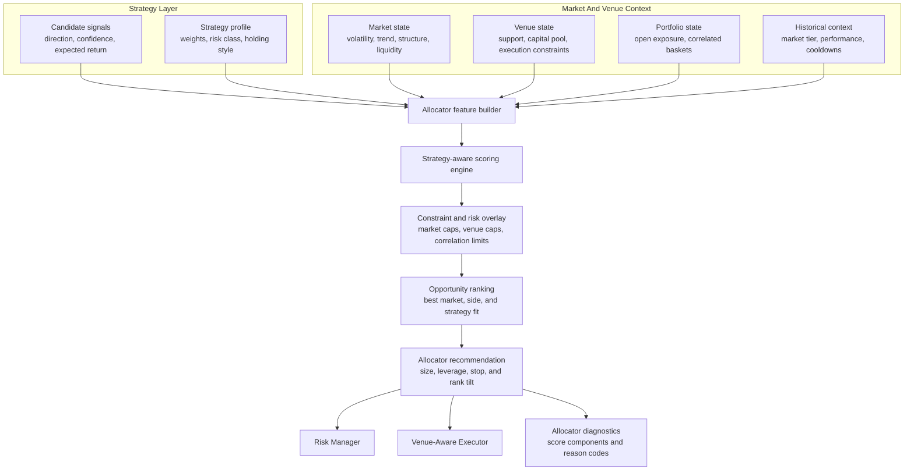
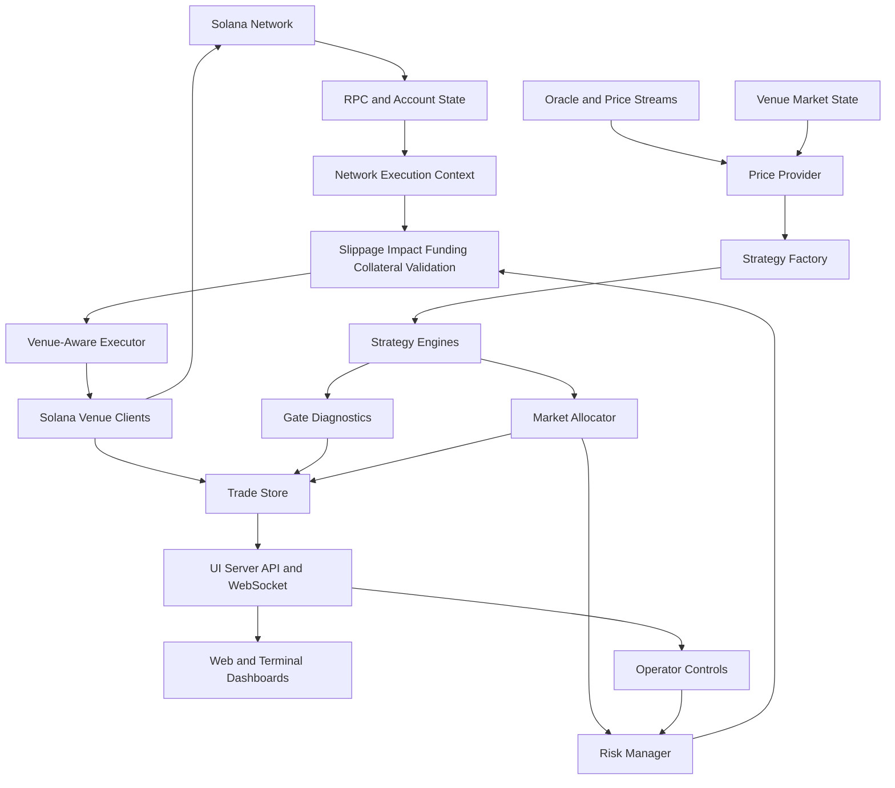

# Product Requirements Document

## Product Summary

The Trading Engine is a production-grade DeFi network application for automated financial trading across Solana-based perpetuals venues, market-data feeds, and operational control surfaces. It is not a single-market strategy script. It is a multi-market orchestration layer that runs multiple quantitative strategies in parallel, evaluates opportunities in real time, normalizes network and venue state, applies layered risk controls, routes execution through venue-specific clients, and exposes dashboards, alerts, logs, and backtesting workflows for monitoring and iteration.

This showcase repository contains a sanitized source-code snapshot intended for technical review. It excludes private environment files, wallet material, runtime databases, logs, caches, and generated result dumps.

## Product Positioning

- **Application type:** Solana network application for financial-trading automation, research, execution, and monitoring.
- **DeFi model:** Wallet-based, non-custodial execution through Solana-based venues; no centralized exchange account is required for execution. Current showcase integrations focus on Solana DeFi venues such as Drift and Jupiter, with an adapter boundary that can support additional DeFi venue types such as dYdX-style perpetuals or AMM-style venues such as PancakeSwap where compatible adapters are added.
- **Market scope:** Multi-market and multi-strategy; the runtime can evaluate different assets and strategy families in the same loop.
- **Network scope:** Integrates Solana transaction clients, perpetuals venue clients, oracle/price infrastructure, WebSocket streams, RPC-backed state reads, and operator-facing APIs.
- **Product value:** Gives an operator and strategy researcher one controlled environment for signal generation, opportunity ranking, risk gating, execution routing, monitoring, and post-trade review.
- **Primary innovation:** Combines DeFi-native venue access, strategy orchestration, dynamic strategy/market-aware allocation, secure wallet/secrets operations, venue-aware execution, staged live modes, and research parity in one runtime instead of separating them into disconnected scripts.

## Goals

- Operate as a Solana network application with explicit boundaries between market-data ingestion, strategy evaluation, risk controls, execution clients, persistence, and operator surfaces.
- Use the advantages of DeFi infrastructure: wallet-controlled access, transparent on-chain settlement, permissionless venue connectivity, and multi-venue routing without centralized exchange custody.
- Run multiple strategy families in the same runtime without configuration bleed between strategies.
- Evaluate signals across markets, rank opportunities, and select trades under portfolio constraints.
- Apply risk controls before and after execution, including sizing, leverage bounds, stop logic, exposure limits, and duplicate-order protection.
- Route execution through the appropriate venue client while supporting paper, live, guarded, shadow, and limited-live flows.
- Normalize venue and network conditions, including market support, liquidity/slippage constraints, funding context, collateral availability, RPC behavior, and execution-mode gates.
- Treat secrets, wallet material, RPC credentials, and operator controls as production infrastructure with encryption, masking, permission checks, and explicit runtime boundaries.
- Provide operational visibility through dashboards, APIs, logs, Telegram-style controls, analytics tables, and backtesting tools.
- Support research iteration through deterministic backtests, strategy sweeps, and diagnostic tests.

## Non-Goals

- This showcase repository is not intended to be run as a live trading engine without private configuration, wallets, RPC endpoints, and deployment secrets.
- Live DeFi execution still requires a funded compatible wallet and private runtime configuration even though it does not require a centralized exchange account.
- The public repository does not include proprietary local datasets, generated analysis outputs, or private leader-wallet configuration.
- The system does not guarantee trading profitability. It is an engineering platform for automated trading research, execution, and monitoring.

## Target Users

### Operator

The operator monitors live status, pauses or resumes trading, closes positions, reviews logs, and checks portfolio/risk state.

Needs:

- Clear runtime status
- Manual override controls
- Position and PnL visibility
- Alerts when execution or connectivity fails

### Strategy Researcher

The researcher develops, tests, and compares strategy variants.

Needs:

- Strategy-specific configuration
- Backtest runners
- Gate and allocator diagnostics
- Repeatable tests and comparable outputs

### Risk Reviewer

The reviewer checks whether the system constrains exposure and handles failures correctly.

Needs:

- Position sizing logic
- Stop and exit behavior
- Portfolio exposure checks
- Execution validation and duplicate-order guards

### Technical Reviewer

The reviewer assesses architecture, code quality, integration points, and operational depth.

Needs:

- Runtime entry points
- Strategy implementations
- Execution clients
- Test coverage
- Data model and architecture diagrams

## Core Capabilities

### DeFi Execution Model

The product is designed around wallet-based DeFi access rather than centralized exchange account infrastructure. Execution is controlled by the operator's wallet configuration and routed through Solana-based venues, allowing the same runtime to access multiple venues while keeping strategy, risk, and execution controls under one application boundary.

DeFi-specific product advantages include:

- Non-custodial execution from wallet-controlled infrastructure
- No centralized exchange account requirement for on-chain execution
- Multiple venue access from one strategy and risk runtime
- Current Solana venue paths such as Drift and Jupiter, plus an adapter pattern for additional DeFi venues
- Permissionless market connectivity where venue support exists
- Transparent on-chain transaction lifecycle and settlement context
- Faster strategy iteration because market access is configuration-driven rather than account-integration driven

### Solana Network Application Layer

The application coordinates Solana-facing infrastructure and off-chain decisioning. It treats network connectivity, venue routing, transaction submission, price freshness, and collateral state as first-class runtime concerns rather than incidental helper calls.

Network-facing capabilities include:

- RPC-backed account and market-state access
- Solana transaction construction, retry, and error classification
- Venue-specific perpetuals clients
- Oracle and price-feed integration for market context
- WebSocket-driven market, leader-wallet, and operational updates
- Collateral, margin, slippage, funding, and liquidation-risk checks before execution

Primary files:

- [src/execution/perps-live-client.js](../src/execution/perps-live-client.js)
- [src/execution/perps-drift-client.js](../src/execution/perps-drift-client.js)
- [src/execution/perps-raw-client.js](../src/execution/perps-raw-client.js)
- [utils/rpc-manager.js](../utils/rpc-manager.js)
- [utils/pyth-websocket-client.js](../utils/pyth-websocket-client.js)
- [utils/improved-multi-price-feed.js](../utils/improved-multi-price-feed.js)
- [utils/transaction-retry.js](../utils/transaction-retry.js)
- [utils/drift-margin.js](../utils/drift-margin.js)

### Multi-Strategy Runtime

The runtime loads strategy-specific configuration and supports multiple strategy families:

- Momentum and breakout
- RSI mean reversion
- BTC breakout
- Scalping
- Predicta-style signal logic
- Ichimoku cloud breakout
- Copy-trading, event-driven copy-trading, and meta copy-trading

Primary files:

- [bot.js](../bot.js)
- [utils/strategy-factory.js](../utils/strategy-factory.js)
- [utils/strategy-env-manager.js](../utils/strategy-env-manager.js)

### Market Opportunity Ranking

The allocator evaluates signals across markets, scores candidates, applies portfolio/per-market constraints, and selects the best opportunities. It is dynamic rather than static: scoring changes by strategy type and market context instead of applying one generic rule to every signal.

Allocator inputs include:

- Strategy type and strategy-specific scoring weights
- Signal confidence and normalized expected return
- Market volatility and trend/structure context
- Historical market tiers and performance multipliers
- Current market exposure and venue-specific capital pools
- Correlated-basket exposure using static and rolling dynamic correlations
- Cooldown penalties or bonuses after recent losses/wins
- Optional allocator-driven size, leverage, stop, and rank-tilt recommendations after selection

Primary files:

- [utils/market-allocator.js](../utils/market-allocator.js)
- [risk-manager.js](../risk-manager.js)
- [utils/portfolio-risk.js](../utils/portfolio-risk.js)

### Strategy-Aware Risk Management

Risk logic varies by strategy type and includes stop loss, take profit, trailing stops, time stops, position sizing, leverage constraints, and funding checks.

Primary files:

- [risk-manager.js](../risk-manager.js)
- [utils/dynamic-leverage.js](../utils/dynamic-leverage.js)
- [utils/slippage-validator.js](../utils/slippage-validator.js)
- [utils/slippage-controller.js](../utils/slippage-controller.js)

### Venue-Aware Execution

The platform routes trades by market, venue support, execution mode, and network state. It tracks which venue opened a position so closes route correctly and separates paper, guarded, shadow, limited-live, and live-oriented execution paths.

Supported execution states include:

- Paper mode
- Live mode
- Guarded execution
- Shadow mode
- Limited live mode

Primary files:

- [src/execution/venue-aware-trade-executor.js](../src/execution/venue-aware-trade-executor.js)
- [src/execution/perps-live-client.js](../src/execution/perps-live-client.js)
- [src/execution/perps-drift-client.js](../src/execution/perps-drift-client.js)
- [drift-subprocess/index.js](../drift-subprocess/index.js)
- [utils/venue-router.js](../utils/venue-router.js)
- [utils/limited-live.js](../utils/limited-live.js)
- [utils/shadow-mode.js](../utils/shadow-mode.js)

### Security And Secrets Operations

Private wallet and credential handling are treated as operational product requirements, not local developer conveniences. The showcase includes tooling for encrypted wallet files, encrypted secrets bundles, masked secret displays, secure wallet loading, and production file-permission checks.

Security capabilities include:

- AES-256-GCM authenticated encryption for wallet/secrets files
- PBKDF2-SHA256 key derivation with per-file salt
- `0600` wallet/secrets file permissions, with hosted-environment exceptions where required
- Secret masking for API keys, Telegram tokens, passwords, and RPC values
- Secure wallet loading from encrypted file, JSON array, or base58 environment format
- No private key bytes in logs or IPC messages
- Separation between public env templates and private runtime values

Primary files:

- [tools/secrets-manager.js](../tools/secrets-manager.js)
- [utils/wallet-encryption.js](../utils/wallet-encryption.js)
- [utils/secure-wallet-loader.js](../utils/secure-wallet-loader.js)

### Protocol Integration And API-Gap Handling

The execution layer includes higher-level clients and lower-level Solana integration paths for protocol surfaces that are incomplete, evolving, or require direct account/transaction handling. This includes PDA derivation, associated-token-account setup, account auditing, transaction message construction, and venue-specific request encoding.

Primary files:

- [src/execution/perps-raw-client.js](../src/execution/perps-raw-client.js)
- [src/execution/pda-utils.js](../src/execution/pda-utils.js)
- [src/execution/perps-live-client.js](../src/execution/perps-live-client.js)

### Monitoring And Control

The application exposes operational status and controls through server endpoints, WebSockets, terminal dashboards, and Telegram-style controls. These surfaces are designed for supervision, not just reporting: operators can pause/resume execution, close positions, inspect portfolio risk, review strategy state, and validate system health without shell access.

Primary files:

- [src/operations/ui-server.js](../src/operations/ui-server.js)
- [src/operations/dashboard.js](../src/operations/dashboard.js)
- [src/operations/telegram-control.js](../src/operations/telegram-control.js)
- [src/operations/control-panel.js](../src/operations/control-panel.js)
- [db.js](../db.js)

### Backtesting And Validation

Backtest runners and tests support strategy evaluation, regression detection, allocator validation, and execution safety checks.

Primary paths:

- [scripts/backtest/](../scripts/backtest)
- [tests/](../tests)

## Functional Requirements

| ID    | Requirement                                        | Acceptance Criteria                                                                                                                            |
| ----- | -------------------------------------------------- | ---------------------------------------------------------------------------------------------------------------------------------------------- |
| FR-0  | Operate as a Solana network application            | Runtime separates off-chain decisioning from Solana network access, transaction routing, venue clients, price feeds, and operator surfaces     |
| FR-0A | Support DeFi-native execution                      | Runtime can operate through wallet-controlled Solana venue clients without requiring centralized exchange account custody                      |
| FR-1  | Load strategy configuration by strategy and market | Strategy config does not bleed across unrelated strategy variants                                                                              |
| FR-2  | Generate signals from multiple strategies          | Runtime can evaluate each enabled strategy and return open/close/hold decisions                                                                |
| FR-3  | Rank candidate trades                              | Allocator scores candidates and selects best opportunities under constraints                                                                   |
| FR-3A | Allocate by strategy and market context            | Allocator changes scoring by strategy type, market tier, performance, volatility, correlation exposure, venue capital pool, and cooldown state |
| FR-4  | Enforce position sizing                            | Risk manager computes size using strategy risk profile and portfolio state                                                                     |
| FR-5  | Enforce exposure controls                          | New trades are blocked when position count, leverage, or exposure limits fail                                                                  |
| FR-6  | Validate execution quality                         | Slippage, market impact, funding, and duplicate-order checks run before execution                                                              |
| FR-7  | Route trades by venue                              | Execution layer selects the correct venue and records venue per position                                                                       |
| FR-8  | Track trade lifecycle                              | Opens, closes, PnL, reason codes, venue, strategy, and mode are persisted                                                                      |
| FR-9  | Emit diagnostics                                   | Gate events and allocator decisions are logged for debugging and review                                                                        |
| FR-10 | Provide operator controls                          | Operator can pause, resume, close positions, and monitor runtime state                                                                         |
| FR-11 | Support backtests                                  | Strategy runners can simulate historical performance using shared backtest utilities                                                           |
| FR-12 | Prevent duplicate runtime instances                | Instance lock and heartbeat prevent multiple conflicting engine processes                                                                      |
| FR-13 | Track network and venue health                     | Runtime can surface stale price data, disconnected streams, execution errors, and degraded venue/network conditions                            |
| FR-14 | Support staged execution rollout                   | Paper, guarded, shadow, limited-live, and live-oriented modes allow strategy and execution changes to be deployed incrementally                |
| FR-15 | Protect wallet and runtime secrets                 | Wallet and credential material are encrypted or loaded privately, masked in displays, permission-checked, and excluded from public source      |
| FR-16 | Handle incomplete/evolving venue APIs              | Execution layer can use low-level Solana account, PDA, ATA, and transaction-building paths when venue SDK/API abstractions are insufficient    |

## Non-Functional Requirements

| Category        | Requirement                                                                                                                 |
| --------------- | --------------------------------------------------------------------------------------------------------------------------- |
| Reliability     | The engine must continue operating when optional services are unavailable where safe fallback behavior exists               |
| Safety          | Execution must pass risk and validation gates before sending live orders                                                    |
| Observability   | Runtime decisions must be inspectable through logs, database records, dashboards, and tests                                 |
| Security        | Secrets must be loaded from environment or encrypted storage and excluded from public source                                |
| Testability     | Core strategy, allocator, venue-routing, risk, and copy-trading components must have targeted tests                         |
| Maintainability | Strategy and venue concerns should stay modular so new strategies or execution paths can be added                           |
| Portability     | The application should support local and hosted operation with configurable database, RPC, wallet, and execution-mode paths |

## Product Architecture

## Data Model

The engineering architecture and implementation requirements are documented in [ERD.md](./ERD.md).

Core persistence areas:

- Trade lifecycle: `trades_open`, `trades_close`
- Duplicate-order protection: `order_guard`
- Strategy diagnostics: `gate_events`
- Allocator diagnostics: `allocator_decisions`
- Candle cache: `market_data`
- Runtime lock: `bot_instances`
- Copy-trading snapshots: `copy_topk_snapshots`

## Key User Flows

### Network Trade Entry

1. Runtime refreshes market data.
2. Price providers and venue clients normalize Solana network, oracle, and market state.
3. Strategy factory evaluates enabled strategies.
4. Strategy emits candidate signal.
5. Market allocator scores and ranks candidates.
6. Risk manager sizes the position and checks exposure.
7. Validation checks slippage, market impact, funding, collateral, price freshness, and duplicate order state.
8. Venue-aware executor routes order to the correct execution client and execution mode.
9. Trade lifecycle is logged and streamed to dashboards.

### Network Trade Exit

1. Runtime monitors open positions.
2. Strategy-specific exit checks run.
3. Risk-level exits run, including stop loss, take profit, time stop, funding, and liquidation protection.
4. Close request routes to the venue that opened the position.
5. Close result, PnL, reason, strategy, venue, and mode are persisted.

### Operator Intervention

1. Operator views status through dashboard or control surface.
2. Operator pauses/resumes trading or requests position close.
3. API validates authentication and command payload.
4. Runtime applies command and updates status.
5. Logs and dashboards reflect the action.

## Risk Controls

- Strategy-specific stop and take-profit settings
- Risk-per-trade and position-size caps
- Portfolio exposure limits
- Market-level position limits
- Strategy/market-aware allocator ranking
- Correlated-basket exposure control
- Dynamic leverage adjustments
- Funding-rate checks
- Slippage and market-impact validation
- Price freshness and stale-feed protection
- Venue and network-mode gating
- Duplicate-order guard
- Instance lock to prevent conflicting runtimes
- Shadow and limited-live modes for staged rollout

## Observability

The system exposes observability through:

- Structured runtime logs
- `trades_open` and `trades_close`
- `gate_events`
- `allocator_decisions`
- WebSocket status streaming
- API endpoints
- Terminal dashboard
- Terminal backtest output snapshots
- Execution-quality and venue-routing diagnostics
- Secrets/security posture checks
- RPC, price-feed, and transaction error classification
- Targeted tests

## Test Coverage Areas

Representative tests in this showcase cover:

- Risk manager behavior
- BTC breakout strategy behavior
- Market allocator behavior
- Venue routing
- Limited-live and shadow-mode gates
- Drift error handling
- Copy-trading consensus and strategy logic
- Hyperliquid WebSocket cache loading

## Security And Sanitization

Private operational material is intentionally excluded. See [SANITIZATION.md](./SANITIZATION.md).

Public source keeps environment variable names because they are part of the configuration interface, but it does not include real secret values, wallet keys, local databases, logs, or generated result files.

## Success Metrics

- Strategies can run in parallel without config collisions.
- Allocator decisions are explainable through strategy-aware component scores, market context, venue exposure, and recorded reasons.
- Risk controls block invalid or oversized trades.
- Wallet and credential handling follows encrypted, masked, permission-checked operational paths.
- Open and close lifecycle records are complete enough to audit trading behavior.
- Backtest and live logic stay comparable enough to diagnose performance drift.
- Operators can monitor status and intervene without shell access.
- Network and venue failures are visible, classified, and handled through safe fallback or fail-closed behavior.

## Future Improvements

- Add a simplified local demo mode that runs without private RPC or wallet configuration.
- Add generated API documentation for dashboard/control endpoints.
- Add a public synthetic dataset for deterministic backtest demonstrations.
- Add network-health replay fixtures for deterministic venue/RPC failure testing.
